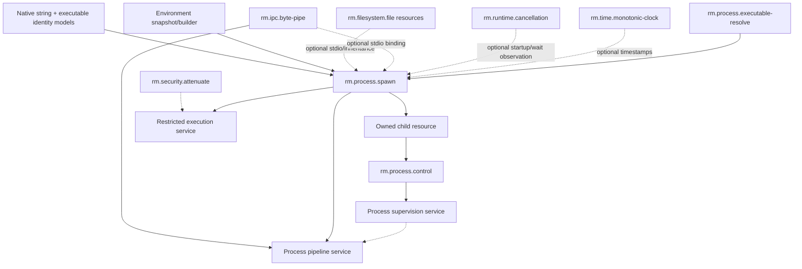

# Process foundations vertical slice

| Field | Value |
|---|---|
| Status | Draft domain analysis |
| Purpose | Define direct executable launch, argument/environment semantics, explicit inheritance, and race-safe child lifecycle |

## Domain boundary

The initial process domain launches a named executable, constructs its argument and environment representation, allowlists inherited resources, and returns an owned child resource with observable startup and termination outcomes.

Shell commands, document/URL activation, detached service installation, elevation, login/session brokering, terminal emulation, pipelines, process discovery, debugging, and restricted execution are separate capabilities or services.

## Candidate model

## Boundary conclusions

- Direct executable launch is the base operation; shell interpretation is never implicit.
- Executable search is explicit policy with a reportable candidate/result, not a side effect of missing identity.
- Arguments and environment use lossless native string values; display text is separate.
- Windows command-line serialization requires a declared target parsing convention.
- Inheritance is allowlist-only; “inherit everything marked inheritable” is not portable safe behavior.
- Successful native process creation is distinct from confirmed execution of the requested image and application readiness.
- A process identifier is an observation, not durable identity or authority; the owned child resource is the control boundary.
- Restricted execution remains a platform service composing spawn with authority and isolation policy.

## Documents

- [Launch and argument model](launch-model.md)
- [Environment model](environment-model.md)
- [Standard-stream binding model](stdio-model.md)
- [Platform research](platform-research.md)
- [`rm.process.executable-resolve`](executable-resolve.md)
- [`rm.process.spawn`](spawn.md)
- [`rm.process.control`](control.md)
- [Process supervision platform service](supervision.md)
- [Process pipeline platform service](pipeline.md)
- [Conformance specification](conformance.md)
- [Benchmark specification](benchmarks.md)
