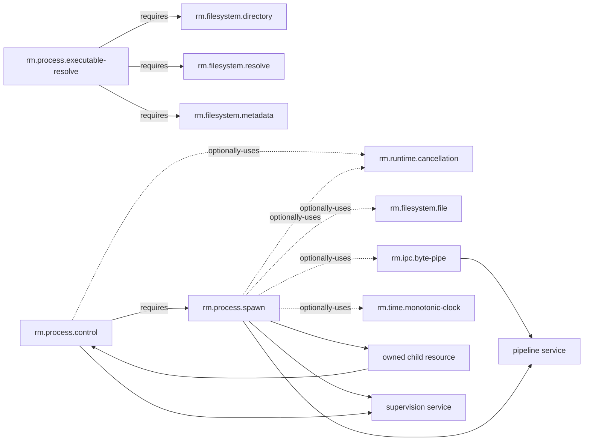

# Process dependency and profile composition

**Status:** Reviewed domain composition  
**Scope:** Process foundations 0.1.1

Capability graph arrows use consumer-to-dependency direction. Resource production/consumption and service composition remain distinct: spawn produces an owned child consumed by control, but that data flow does not reverse the required `control → spawn` capability edge.

| Relationship | Type | Required boundary |
|---|---|---|
| executable-resolve → filesystem directory/resolve/metadata | required capability edges | compatible generations and explicit authority/R-level/metadata identity semantics |
| control → spawn | required capability edge | control consumes the owned-child resource contract, never a PID as authority |
| control → cancellation | optional capability edge | cancellation stops waiting where possible and cannot retract delivered control |
| spawn → file/pipe/cancellation/clock | optional capability edges | selected manifest bindings/observations do not strengthen base spawn requirements |
| supervision and pipeline | service composition | exact P-level, pipe quality, control/timer/cancellation policies are resolved by the service manifest |

The [CLI profile](../profiles/foundation-cli.md) requires spawn and control `>=0.1.0,<0.2.0`; executable resolution is optional and explicit. Desktop and server inherit that foundation; the [server profile](../profiles/foundation-server.md) conditionally selects supervision for managed workers. The [headless profile](../profiles/foundation-headless.md) makes the process feature set optional and explicitly budgeted.

**RM-PROCESS-DEPENDENCY-0001:** A selecting profile MUST resolve compatible spawn, control, executable-resolution-if-used, filesystem/IPC/runtime dependencies, parser convention, startup milestones, and P-level/service policies.

**RM-PROCESS-DEPENDENCY-0002:** Resource flow, service composition, profile membership, and capability dependency edges MUST remain distinct; none may be inferred solely from a diagram or shared identifier.

**RM-PROCESS-DEPENDENCY-0003:** Optional dependencies MUST NOT become hidden runtime, ambient search, broad inheritance, or stronger minimum containment requirements.

**RM-PROCESS-DEPENDENCY-0004:** Profile satisfaction MUST NOT imply shell support, activation, restricted execution, durable services, arbitrary signals, terminal emulation, or uniform descendant control.
