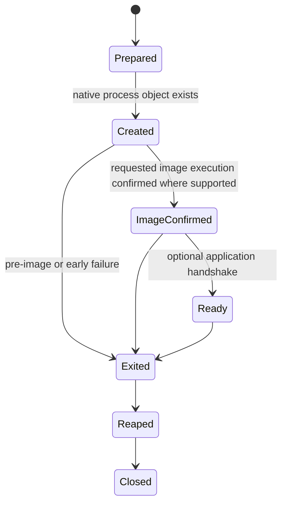

# Process launch and argument model

**Status:** Draft

## Launch kinds

| Kind | Meaning |
|---|---|
| Direct | Execute an explicitly identified executable with structured arguments |
| Search | Resolve a program name under an explicit ordered search policy, then direct launch |
| Shell | Pass a command representation to an explicitly selected shell contract |
| Activate | Ask a desktop/service facility to open a document, URL, or application |

Only direct launch belongs to `rm.process.spawn` 0.1. Search, shell, and activation are distinct because they add policy, parsing, association, and security behavior.

## Executable identity

An executable request identifies a resolved executable resource where the platform permits it, or an explicit native path plus resolution/evidence policy. A bare display name is not executable authority. Selection records the exact resolved native identity available at launch time, code-signing/hash evidence when policy requires it, and the remaining replacement race if the native launch primitive cannot bind to the inspected object.

## Arguments

Arguments are an ordered sequence of lossless native string values that exclude embedded native terminators. They are not a prejoined command line and undergo no shell expansion, variable expansion, globbing, or quote interpretation in the common model.

POSIX-style providers map the sequence to `argv`. Windows providers must serialize a command line and therefore select a declared target convention:

| Convention | Intended target |
|---|---|
| Microsoft C runtime compatible | Targets using the documented/common CRT argument decomposition |
| CommandLineToArgvW compatible | Targets explicitly using that convention |
| Verbatim command line | Caller supplies native command-line syntax; loses structured-argument guarantee |
| Provider-specific | Named parser/adapter with conformance vectors |

A provider cannot claim arbitrary-target round-trip fidelity. Verbatim mode is an explicit extension and never accepts secrets without disclosure because process command lines may be observable.

## Startup milestones

Providers state which milestones are observable. `Created` never implies `Ready`. POSIX providers must account for implementations where some spawn failures appear as child exit 127 and cannot be uniquely distinguished from application exit without an additional handshake.

