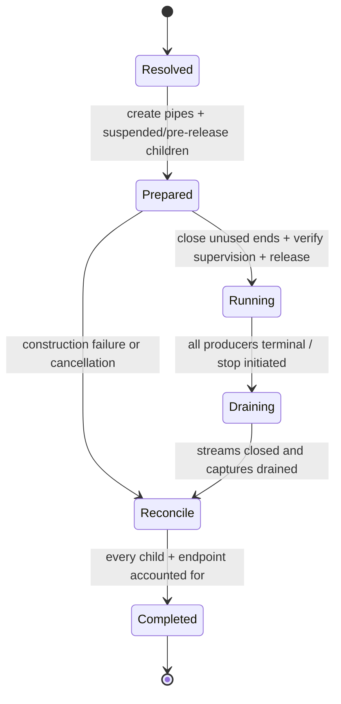

# Process pipeline platform service

| Field | Value |
|---|---|
| Status | Draft service contract |
| Contract version | 0.1.0 |
| Layer | Platform services |

## Purpose

Construct and supervise a directed graph of direct child processes and byte-stream endpoints without invoking a shell, while making startup atomicity, backpressure, capture limits, failure propagation, status aggregation, and cleanup explicit.

The initial service supports an acyclic graph. Cycles require a protocol-level deadlock and shutdown design and remain outside version 0.1.

## Manifest

The immutable manifest contains:

- nodes with direct spawn manifests and readiness requirements;
- directed byte-stream edges and standard-stream bindings;
- external sources, sinks, captures, and merge policy;
- pipe async quality and resource budgets;
- construction release order;
- supervision/containment level;
- cancellation, timeout, failure, escalation, and aggregate-status policy;
- capture size, spill, truncation, and sensitivity policy.

## Requirements

- **RM-PROCESS-PIPELINE-0001:** The complete acyclic graph, authority, resource budget, and provider set **MUST** resolve before any child-controlled code is released.
- **RM-PROCESS-PIPELINE-0002:** Construction **MUST** close every unused endpoint in parent and children before release so EOF and broken-peer semantics are not delayed by hidden duplicates.
- **RM-PROCESS-PIPELINE-0003:** A partial construction failure **MUST** close prepared endpoints, reconcile every created child, and return no ambiguous running pipeline.
- **RM-PROCESS-PIPELINE-0004:** Each edge **MUST** declare byte-stream direction, async quality, backpressure, and content sensitivity; text/line framing **MUST NOT** be inferred.
- **RM-PROCESS-PIPELINE-0005:** Parent-captured streams **MUST** be drained concurrently or governed by a bounded policy that cannot deadlock solely because another captured stream fills.
- **RM-PROCESS-PIPELINE-0006:** Capture limits **MUST** select fail, truncate-with-disclosure, spill-to-explicit-authority, or backpressure; silent unbounded accumulation is prohibited.
- **RM-PROCESS-PIPELINE-0007:** Failure policy **MUST** state whether upstream/downstream peers continue, receive EOF/broken-peer, are cooperatively stopped, or are forcefully terminated.
- **RM-PROCESS-PIPELINE-0008:** Cancellation **MUST** stop new construction, apply the declared running-child policy, close endpoints in a defined order, and reconcile terminal states.
- **RM-PROCESS-PIPELINE-0009:** Aggregate completion **MUST** retain every node's startup and terminal status; a summary status **MUST** name its selection rule and cannot erase constituent failures.
- **RM-PROCESS-PIPELINE-0010:** Root completion, all-node completion, contained-set empty, and capture-drained completion **MUST** be distinct milestones.
- **RM-PROCESS-PIPELINE-0011:** Dropping the service handle **MUST** follow explicit detach, transfer, or terminate policy and cannot rely on destructor timing for correctness.
- **RM-PROCESS-PIPELINE-0012:** Diagnostics **MUST** describe topology and outcomes with sensitive arguments, environment, paths, and stream data redacted by field policy.

## Lifecycle

## Status policies

Built-in policy classes may include all-success, last-node, first-failure, and explicit reducer. Their names are convenience; the report always contains the full node result map, startup failures, control actions, truncation/spill disclosures, and unobserved/indeterminate states.

## Dependencies

Requires `rm.process.spawn` and `rm.ipc.byte-pipe`. Uses process supervision when the manifest requires group lifecycle and optionally uses `rm.process.control`, cancellation, and deadline timers. It never requires a shell.

