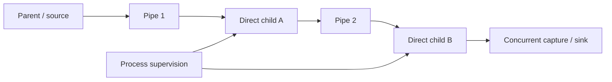

# Process standard-stream binding model

**Status:** Draft semantic model

Each child standard channel—input, output, and error—is bound independently before launch.

| Binding | Meaning |
|---|---|
| Closed | Child receives no usable channel, subject to platform-required placeholder behavior |
| Null | Reads yield EOF; writes are discarded through a provider null resource |
| Inherit explicit | Bind an explicitly captured parent/native endpoint, not “whatever is current later” |
| Resource | Bind a compatible authority-bearing byte-stream/file/terminal endpoint |
| New pipe | Create `rm.ipc.byte-pipe`, bind the child end, and return the parent end |
| Merge | Bind standard error to the exact same underlying endpoint/open description as standard output where supported |

## Rules

- Direction is validated before launch: child input consumes a readable endpoint; output/error require writable endpoints.
- Only child ends are inherited. Parent-only and unused duplicates close before child release so EOF and broken-peer detection remain correct.
- Text encoding, newline conversion, terminal modes, and message framing are not standard-stream properties; they require explicit adapters.
- Merging output and error does not promise record or line atomicity, cross-stream ordering before the merge point, or timestamps.
- Capturing both output and error requires concurrent draining or a bounded backpressure policy; sequential unbounded reads can deadlock the pipeline.
- Early child exit, spawn failure, cancellation, and parent drop have explicit endpoint cleanup and ownership outcomes.
- Sensitive-stream capture is opt-in and follows diagnostic retention/redaction policy.

## Pipeline composition

A pipeline is a platform service/framework composition of direct spawns and byte pipes. It owns construction ordering, endpoint transfer, closure of all unused ends, concurrent draining, group supervision, failure policy, and aggregate status. Shell syntax is not involved.

