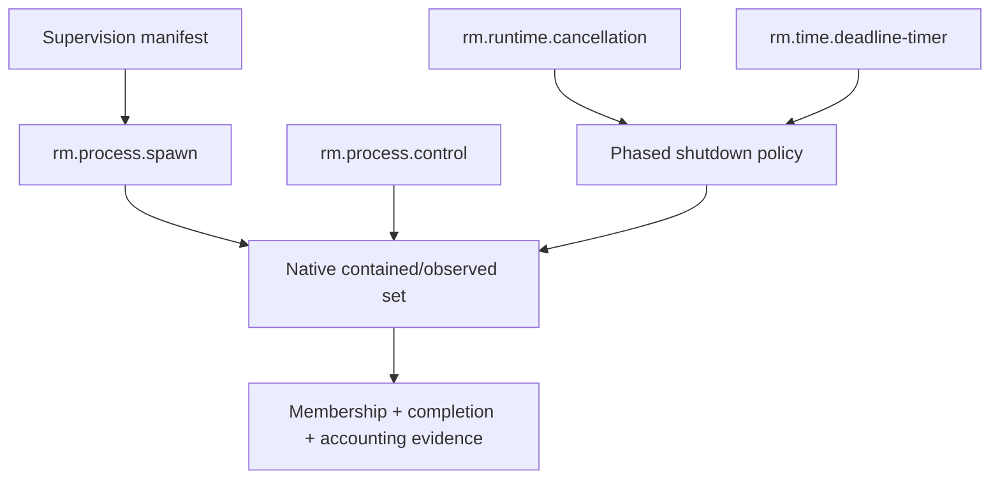

# Process supervision platform service

| Field | Value |
|---|---|
| Status | Draft service contract |
| Contract version | 0.1.0 |
| Layer | Platform services |

## Purpose

Create and supervise a changing set of related processes under declared membership, control, completion, accounting, and escape guarantees. This service composes spawn, child control, timing/cancellation, policy, and native containment mechanisms.

## Containment claims

| Level | Claim |
|---|---|
| P0 — Observed | Known direct children are tracked; descendants may escape or be missed |
| P1 — Cooperative group | Members share a control group/session by convention; members may leave or bypass it |
| P2 — Native contained set | Native mechanism automatically associates ordinary descendants and prevents unapproved escape under stated assumptions |
| P3 — Verified contained lifecycle | P2 plus atomic pre-execution membership, descendant accounting, supervisor-failure policy, and adversarial escape evidence |

Levels are scoped by platform/version, parent containment, privilege, sandbox, launch mechanism, and breakaway policy. A higher level does not imply security isolation; restricted execution adds authority constraints.

## Requirements

- **RM-PROCESS-SUPERVISION-0001:** The manifest **MUST** declare membership rule, minimum containment level, permitted breakaway, orphan policy, and supervisor-failure behavior.
- **RM-PROCESS-SUPERVISION-0002:** Required containment **MUST** be established before supervised child code can create descendants.
- **RM-PROCESS-SUPERVISION-0003:** A provider **MUST** disclose processes that are observed but not contained and mechanisms by which members may escape.
- **RM-PROCESS-SUPERVISION-0004:** Group control **MUST** state snapshot-versus-dynamic membership and whether processes joining during dispatch are included.
- **RM-PROCESS-SUPERVISION-0005:** Group completion **MUST** distinguish root exit, all-known-members exit, and native-contained-set empty.
- **RM-PROCESS-SUPERVISION-0006:** Graceful shutdown **MUST** be phased: stop admission, cooperative request, bounded wait, optional escalation, terminal reconciliation.
- **RM-PROCESS-SUPERVISION-0007:** Forced group termination **MUST** disclose cleanup and durability loss and confirm terminal membership separately from dispatch.
- **RM-PROCESS-SUPERVISION-0008:** Accounting **MUST** identify whether values include exited members, escaped members, descendants, and measurement loss.
- **RM-PROCESS-SUPERVISION-0009:** Closing the supervisor **MUST** follow explicit detach, transfer, or terminate policy; drop alone cannot select policy.
- **RM-PROCESS-SUPERVISION-0010:** A containment failure or unsupported parent environment **MUST** fail before release unless the manifest permits the exact reported degradation.

## Composition

The orderly shutdown service may orchestrate a supervision service but does not redefine its containment. Restricted execution may use supervision and additionally constrains authority, identity, resources, and sandbox state.

## Platform direction

- **Windows:** job objects provide managed sets, limits, notifications, accounting, and group termination; nesting, existing parent jobs, and breakaway policy affect guarantees.
- **Linux:** process groups/sessions are cooperative grouping; cgroups and service-manager scopes can provide stronger membership/accounting; pidfds strengthen individual references.
- **macOS:** process groups/sessions support signaling semantics, while XPC/launchd/Service Management may be appropriate for durable services; exact containment differs by deployment.

