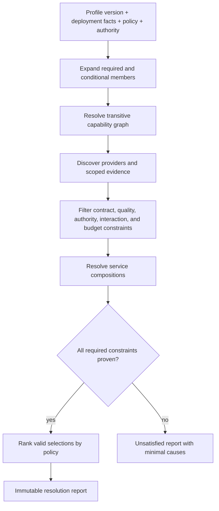

# Profile contract and resolution rules

**Status:** Draft schema 0.1.0

## Profile identity

Profile identifiers use `rm.profile.<family>.<name>` and carry an independent SemVer contract version. A profile version identifies its requirement set, not a binary package or provider version.

Each profile records:

- identifier, version, maturity, owner, purpose, and workload assumptions;
- required and optional capability identities with contract ranges;
- required and optional platform services;
- quality, authority, interaction, resource-budget, and evidence constraints;
- permitted emulation and degradation by requirement;
- known missing domains and non-goals;
- conformance scenarios and compatibility history.

Normative profile constraints use stable identifiers `RM-PROFILE-<FAMILY>-<NAME>-<NNNN>`. They survive editorial movement and are never reused after retirement. Capability member identity plus contract range is not a substitute for an identifier because quality and policy constraints also require traceability.

## Requirement strength

| Strength | Resolution behavior |
|---|---|
| Required | Failure to satisfy makes the profile unsatisfied |
| Conditional | Required when its explicit predicate is true; the predicate result is reported |
| Optional | Absence is acceptable; presence cannot change base guarantees silently |
| Prohibited | Selection fails if the behavior/provider property is present |

“Preferred” is policy ranking, not requirement strength. It cannot make an unsatisfied candidate valid.

## Resolution algorithm

Resolution is deterministic for identical profile, deployment facts, policy, authority, provider catalog, and evidence set. If policy ranking permits several equivalent results, the tie-break rule and candidate set are reported.

## Rules

1. Contract ranges and every nonfunctional constraint are matched before selection.
2. Unknown evidence never satisfies a required claim.
3. Native, emulated, degraded, and unavailable are evaluated per capability and quality dimension.
4. Emulation or degradation is allowed only where that profile requirement says so.
5. Authority is checked both for provider discovery and intended operation; resolution never elevates it.
6. Interactive behavior must match the execution context; a prompt-capable provider does not satisfy a non-interactive requirement unless prompting is prohibited and the operation remains available.
7. Services are resolved after their component capability graphs and policies; they are not capability nodes.
8. Prohibited behavior is evaluated transitively, including provider side effects such as network use, synchronization, or ambient inheritance.
9. Cached resolution is invalidated when an input fact or scoped evidence observation changes.
10. A report records all evaluated constraints, including optional absences and accepted degradations.

## Evolution

Adding a required member, narrowing a contract range, strengthening a quality/security constraint, or newly prohibiting behavior is profile-major. Adding an optional member or an alternative that cannot alter existing valid selections is profile-minor. Editorial clarification is patch. A profile cannot inherit another and silently weaken it; a weaker workload receives a distinct identity.
