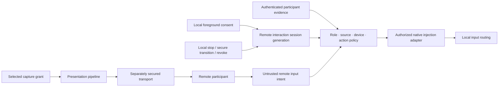

# Remote presentation and controlled input foundations vertical slice

| Field | Value |
|---|---|
| Status | Draft domain analysis |
| Purpose | Compose consent-bound observation, transport, participant identity, and controlled input without turning screen capture into ambient remote-control authority |

## Conclusions

- Observation, encode, transport, participant authentication, control, clipboard transfer, file transfer, elevation, and unattended access are distinct capabilities.
- A remote session binds the local user/session, exact capture-source generation, authenticated participant, allowed device classes/actions, transport binding, purpose, visibility, lifetime, and revocation.
- Remote events are untrusted intent. Policy is checked at admission and again immediately before injection; neither authentication nor view permission authorizes control.
- Input injection is a privileged side effect, not a replay or simulation guarantee. Target focus, layout, state, integrity, secure-input policy, and native routing remain authoritative.
- Pressed keys/buttons/touches have explicit ownership and cleanup. Revocation synthesizes safe release where permitted and reports ambiguity.
- Local input, secure attention, lock/switch, permission UI, and an accessible emergency stop cannot be overridden by a remote participant.

## Documents

- [Session, participants, and roles](session-participants.md)
- [Presentation pipeline and transport boundary](presentation-transport.md)
- [Input intent and injection](input-injection.md)
- [Coordinate, keyboard, and text semantics](coordinate-keyboard-text.md)
- [Focus, secure input, and privileged boundaries](focus-secure-boundaries.md)
- [State, ordering, and recovery](state-ordering-recovery.md)
- [Consent, indication, and emergency stop](consent-indication-stop.md)
- [Security, privacy, and accessibility](security-accessibility.md)
- [Platform research](platform-research.md)
- [Conformance](conformance.md)
- [Benchmarks](benchmarks.md)
