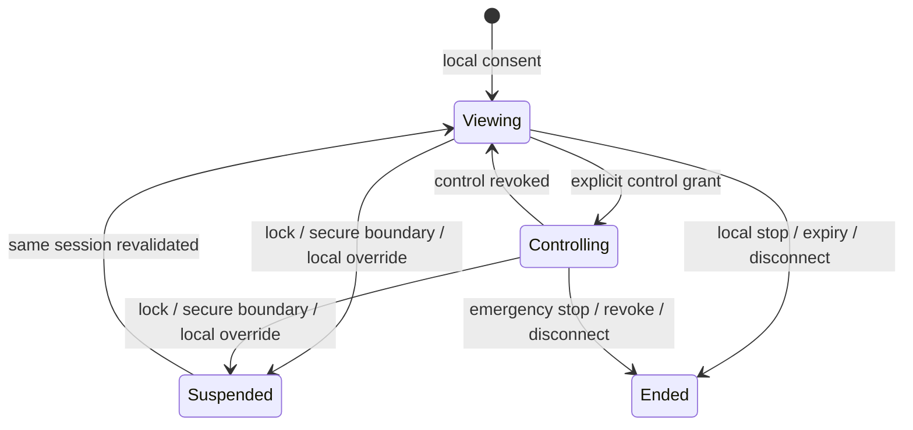

# Consent, indication, and emergency stop

**RM-REMOTE-INTERACTION-CONSENT-0001:** Interactive control MUST require conspicuous local consent identifying participant, purpose, shared source, device/action scope, expected duration, recipient, and stop mechanism.

**RM-REMOTE-INTERACTION-CONSENT-0002:** View-only and control-active states MUST be continuously and accessibly distinguishable. Native indicators are preserved; application indication covers unverified native behavior without impersonating trusted UI.

**RM-REMOTE-INTERACTION-CONSENT-0003:** A local emergency stop MUST be always reachable by documented keyboard and accessible UI paths, operate without remote cooperation or network availability, and revoke admission before other teardown.

**RM-REMOTE-INTERACTION-CONSENT-0004:** Remote input MUST NOT activate, dismiss, capture, hide, or reposition the emergency stop or trusted consent/permission UI.

**RM-REMOTE-INTERACTION-CONSENT-0005:** Consent expansion—from view to control, source change, new device class, privileged action, new participant, or unattended mode—MUST be an explicit foreground transition rather than a mutable checkbox hidden in the session.

**RM-REMOTE-INTERACTION-CONSENT-0006:** Lock, user switch, secure-input transition, local policy change, indicator failure, or unexplained participant/channel change MUST suspend control pending reconciliation.

**RM-REMOTE-INTERACTION-CONSENT-0007:** Consent denial, cancel, revoke, expiry, policy restriction, and provider inability MUST remain distinct outcomes with localized accessible recovery guidance.
