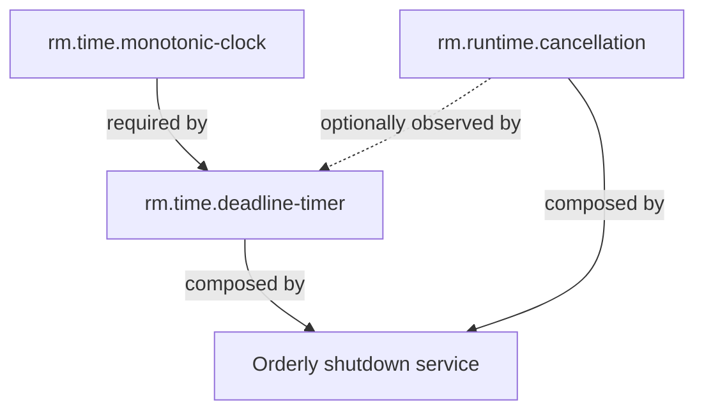

# Runtime and time vertical slice

**Status:** Draft domain analysis  
**Purpose:** Exercise the capability model against timing, cancellation, and lifecycle behavior before API design.

## Why this slice

Time and cancellation appear simple but expose difficult cross-platform questions: whether clocks advance during suspend, whether timers wake a sleeping machine, how timer coalescing affects deadlines, what cancellation actually guarantees, and how shutdown handles work that does not cooperate. The slice also spans synchronous and asynchronous consumers without requiring an application framework.

## Candidate model

The diagram is conceptual. The accepted edge direction is defined in each specification:

- [`rm.time.monotonic-clock`](monotonic-clock.md) has no required capability dependency.
- [`rm.time.deadline-timer`](deadline-timer.md) requires a compatible monotonic-clock domain and optionally observes cancellation.
- [`rm.runtime.cancellation`](cancellation.md) has no required OS capability; operation-specific providers may bridge it to native cancellation.
- The [orderly shutdown platform service](shutdown.md) composes cancellation and deadlines to bound graceful phases. [ADR-0005](../../adr/0005-orderly-shutdown-is-a-platform-service.md) excludes it from the capability graph.

## Scenarios

| ID | Scenario | Primary concern |
|---|---|---|
| RT-001 | Measure elapsed active execution across wall-clock adjustment | Monotonicity |
| RT-002 | Measure elapsed time that includes system suspend | Clock-domain selection |
| RT-003 | Await a deadline asynchronously without occupying a worker thread | Async completion |
| RT-004 | Block synchronously until the same deadline | Sync completeness |
| RT-005 | Cancel before an operation begins | Immediate observation |
| RT-006 | Race cancellation against successful completion | Outcome integrity |
| RT-007 | Begin shutdown, reject new work, and drain existing work | Lifecycle ordering |
| RT-008 | Escalate when graceful shutdown exceeds its deadline | Bounded termination |
| RT-009 | Coalesce tolerant timers to reduce wakeups | Power/performance policy |
| RT-010 | Diagnose a late timer without recording sensitive workload data | Observability |

## Boundary conclusions

- Wall/calendar time is a separate domain and cannot be used for elapsed-time contracts.
- Clock reading and deadline delivery are distinct capabilities: a consumer may need measurements without scheduling.
- Cancellation is cooperative state propagation, not forced thread termination.
- Native operation cancellation belongs to each operation's contract because guarantees differ by mechanism.
- Shutdown is coordinated policy over owned work; it is not equivalent to process termination.
- Orchestration and escalation make orderly shutdown a platform service rather than a capability.
- Wake-from-suspend is an optional authority-bearing extension, not part of the base timer guarantee.

## Research status

Initial platform mapping is recorded in [platform research](platform-research.md). Open questions and decisions needed before RFC acceptance are tracked in [open questions](open-questions.md).
