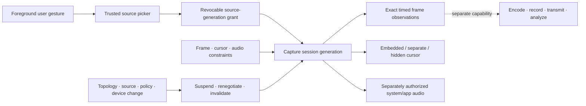

# Screen and window capture foundations vertical slice

| Field | Value |
|---|---|
| Status | Draft domain analysis |
| Purpose | Capture user-selected display, window, application, or region observations under revocable authority without implying desktop enumeration, semantic completeness, confidentiality, recording, or remote-control authority |

## Conclusions

- Source discovery, trusted selection, capture, preview, screenshot, encoding, recording, transmission, analysis, and remote input are distinct capabilities.
- A trusted picker returns an opaque, purpose-bound, revocable grant for an exact source generation; labels, window handles, coordinates, and enumeration results are not authority.
- A captured frame is a compositor/provider observation. It does not prove what a user saw, semantic completeness, faithful physical appearance, or successful exclusion of sensitive content.
- Frames expose exact layout, color, alpha, content geometry, timestamp boundary and clock, sequence, discontinuity, damage, provenance, and buffer lifetime.
- Cursor and audio are explicit negotiated streams. Microphone, camera, persistence, and remote control require separate authority.
- Delivery is bounded. Source replacement, resize, display migration, protected content, revocation, and device loss create visible state transitions rather than silent retargeting.

## Documents

- [Source selection and identity](source-selection.md)
- [Session authority and lifecycle](session-authority.md)
- [Frame format, color, and timing](frame-format-timing.md)
- [Cursor and audio](cursor-audio.md)
- [Geometry, occlusion, and observation boundaries](geometry-occlusion.md)
- [Protected content and capture exclusion](protected-content.md)
- [Change, delivery, and backpressure](change-backpressure.md)
- [Security, privacy, and accessibility](security-accessibility.md)
- [Platform research](platform-research.md)
- [Conformance](conformance.md)
- [Benchmarks](benchmarks.md)
