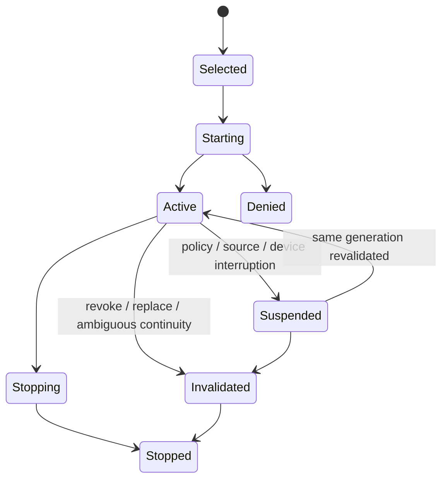

# Session authority and lifecycle

**RM-SCREEN-CAPTURE-SESSION-0001:** Capture authority MUST be least-privilege, purpose-bound, application-bound, source-generation-bound, revocable, and no longer lived than the session that consumes it.

**RM-SCREEN-CAPTURE-SESSION-0002:** Starting and resuming MUST revalidate native permission, source generation, requesting application/session identity, foreground or interaction policy, and effective privacy indication.

**RM-SCREEN-CAPTURE-SESSION-0003:** `selected`, `start_requested`, `native_accepted`, `first_valid_frame`, `active`, `suspended`, `stop_requested`, `native_stopped`, `buffers_released`, and `indicator_cleared` MUST be distinct observable milestones.

**RM-SCREEN-CAPTURE-SESSION-0004:** Revocation, source closure, session lock/switch, secure desktop, policy denial, and provider/device loss MUST suspend or invalidate delivery promptly and MUST retire late frames from the prior generation.

**RM-SCREEN-CAPTURE-SESSION-0005:** Cancellation is a request, not proof that capture or callbacks have stopped. Completion MUST identify the terminal milestone reached, outstanding buffers, and indicator state.

**RM-SCREEN-CAPTURE-SESSION-0006:** A one-shot screenshot MUST be modeled as a finite capture session with the same selection, authority, frame, privacy, and cleanup rules.

**RM-SCREEN-CAPTURE-SESSION-0007:** Delegation across a process boundary MUST attenuate source, purpose, output, lifetime, and recipient; raw grant serialization or inheritance is forbidden.

The capability does not grant background persistence. A provider may require re-prompting after restart, logout, policy change, source change, or elapsed time. Applications must display current state even when native indication is absent or cannot be verified.
