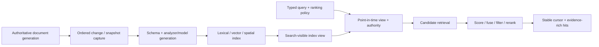

# Search, indexing, and retrieval foundations

| Field | Value |
|---|---|
| Status | Draft domain analysis |
| Purpose | Build and query bounded derived indexes with explicit source, visibility, ranking, approximation, authority, migration, and recovery evidence |

## Conclusions

- A search index is a derived, reconstructable projection; mutation acceptance, durability, replica recovery, refresh visibility, and source-of-truth commit remain separate milestones.
- Every query binds an immutable index-view generation plus schema, analyzer, embedding, ranking, authorization, and tenant context.
- Scores are policy- and provider-scoped ordering evidence, not portable probabilities or universally comparable quantities.
- Approximate retrieval exposes recall/latency/resource policy and never silently substitutes for exact retrieval where completeness is required.
- Stable pagination uses a point-in-time view and deterministic total order; offsets alone do not define a coherent traversal under mutation.

## Documents

- [Model, entities, and milestones](model.md)
- [Document identity and source capture](identity-ingestion.md)
- [Schema, mappings, and analysis](schema-analysis.md)
- [Visibility, consistency, and lifecycle](visibility-lifecycle.md)
- [Lexical and structured retrieval](lexical-structured.md)
- [Vector, spatial, and hybrid retrieval](vector-spatial-hybrid.md)
- [Query, ranking, and result contracts](query-ranking-results.md)
- [Pagination, facets, and highlighting](pagination-facets-highlighting.md)
- [Security, privacy, and multi-tenancy](security-privacy.md)
- [Migration, rebuild, and recovery](migration-recovery.md)
- [Cross-cutting qualities](cross-cutting.md)
- [Platform and provider research](platform-research.md)
- [Conformance](conformance.md)
- [Benchmarks and relevance evaluation](benchmarks.md)

## Decisions

- [ADR-0108: Search visibility is a versioned projection milestone](../../adr/0108-search-visibility-is-a-versioned-projection-milestone.md)
- [ADR-0109: Ranking scores are policy-scoped ordering evidence](../../adr/0109-ranking-scores-are-policy-scoped-ordering-evidence.md)

## Boundary

This domain does not redefine authoritative databases, object stores, event delivery, caching, language models, geodesy, authorization, product taxonomies, document formats, or user-interface search behavior. Products select documents, schemas, analyzers/models, engines/topology, queries, relevance policy, tenancy, freshness, recovery, objectives, and legal policy through RFCs.
