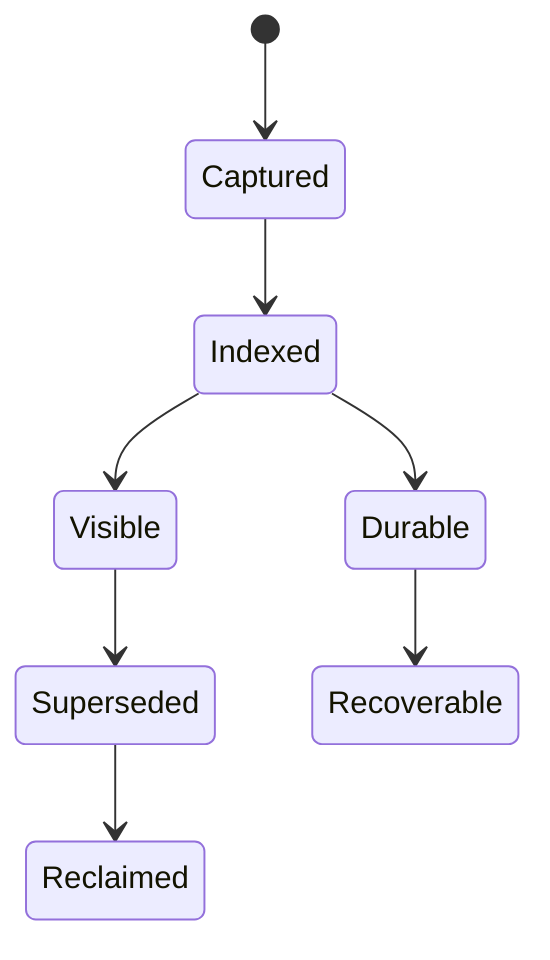

# Model, entities, and milestones

**RM-SEARCH-MODEL-0001:** A search domain binds source authority, document namespace, schema/mapping, analysis/model, index topology, ranking policy, tenant/security policy, retention, objectives, and configuration generations.

**RM-SEARCH-MODEL-0002:** Distinct entities include source document generation, captured mutation, indexed document, shard/segment, committed index generation, search-visible view, point-in-time snapshot, query plan, candidate, ranked hit, cursor, and evaluation judgment.

**RM-SEARCH-MODEL-0003:** Milestones distinguish source commit, capture acceptance, transformation, primary indexing, durability, replica acknowledgment, refresh/view publication, query acceptance, shard completion, candidate retrieval, ranking, page materialization, and caller observation.

**RM-SEARCH-MODEL-0004:** Search results identify targeted and successful/failed/skipped partitions, view generation or freshness watermark, partial/timed-out/terminated state, ranking policy, approximation, total-hit relation, and provider evidence.

**RM-SEARCH-MODEL-0005:** Errors preserve phase, domain/index/view/query fingerprints, retry and idempotency safety, partial hits/aggregations, failed partitions, timeout/cancellation, ambiguous mutation, and reconciliation obligations.

**RM-SEARCH-MODEL-0006:** Async ingestion/search are bounded and cancellation-safe; sync equivalents never create a hidden runtime and disclose blocking, callback, network, and thread behavior.

