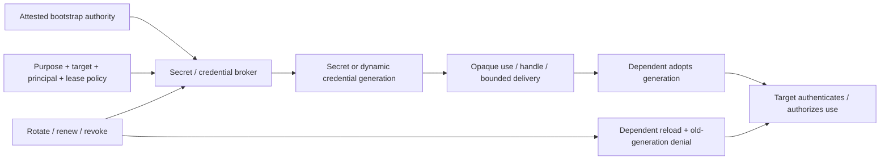

# Secrets lifecycle, dynamic credentials, and privileged-access brokerage

| Field | Value |
|---|---|
| Status | Draft domain analysis |
| Purpose | Govern secret and credential lifecycles from bootstrap through use, rotation, revocation, recovery, and leak response without overstating storage or deletion guarantees |

## Conclusions

- A secret value, stored item, credential, lease, handle, use operation, delivery artifact, and target-side authentication result are distinct entities.
- Secret-zero is replaced where possible by attested workload/platform authority and a local broker; unavoidable bootstrap material is narrowly scoped, short-lived, and rotated immediately.
- Dynamic credentials are leases with target-side lifecycle effects, not merely expiring strings returned by a vault.
- Rotation completes only after dependents use the successor and the predecessor is denied or an explicit residual is recorded.
- Use without reveal is an operation contract proving that plaintext remains inside a named provider boundary; reference storage alone cannot make that claim.

## Documents

- [Model and lifecycle milestones](model.md)
- [Secret identity, versions, and metadata](secret-versions.md)
- [Bootstrap and workload identity](bootstrap-workload.md)
- [Dynamic credentials and leases](dynamic-credentials.md)
- [Brokers, agents, and provider protocols](brokers-providers.md)
- [Use without reveal and cryptographic operations](use-without-reveal.md)
- [Delivery, injection, and dependent adoption](delivery-injection.md)
- [Rotation, renewal, revocation, and reconciliation](rotation-reconciliation.md)
- [Privileged checkout and break-glass](privileged-access.md)
- [Leak detection and incident response](leak-response.md)
- [Backup, recovery, migration, and deletion](recovery-migration.md)
- [Platform and standards research](platform-research.md)
- [Cross-cutting qualities](cross-cutting.md)
- [Conformance](conformance.md)
- [Benchmarks](benchmarks.md)

## Decisions

- [ADR-0132: Secret rotation completes at successor use and predecessor denial](../../adr/0132-secret-rotation-completes-at-successor-use-and-predecessor-denial.md)
- [ADR-0133: Use without reveal is a provider-mediated operation contract](../../adr/0133-use-without-reveal-is-a-provider-mediated-operation-contract.md)

## Boundary

This domain composes protected secret storage, cryptographic keys, authentication, authorization, identity governance, background services, configuration, and observability. It does not choose a vault, cloud, database, PAM product, secret naming scheme, organizational approval process, rotation interval, or target credential type.
