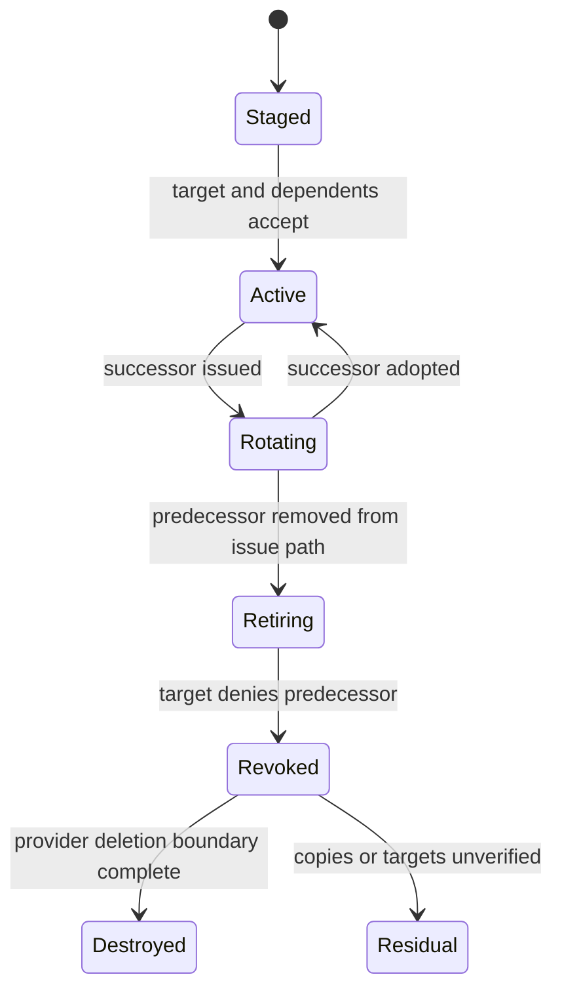

# Model and lifecycle milestones

**RM-SECRETS-MODEL-0001:** Secret descriptor, secret value, stored item, credential, lease, version, handle, delivery artifact, dependent binding, target account, use operation, and target authentication result are distinct typed entities.

**RM-SECRETS-MODEL-0002:** A secret generation binds provider/path identity, class, purpose, target/audience, subject/actor, tenant, creation/activation/expiry, predecessor/successor, policy, protection claims, exportability, renewability, revocation, and provenance without exposing value-derived fingerprints.

**RM-SECRETS-MODEL-0003:** Lifecycle milestones distinguish generated, persisted, staged, delivered, loaded, active, used successfully, successor issued, issue path cut over, predecessor rejected by target, provider-deleted, backup-expired, and residual.

**RM-SECRETS-MODEL-0004:** Terminal outcomes distinguish denied, unavailable, locked, expired, revoked, unsupported, target rejected, lease orphaned, adoption failed, ambiguous external effect, partially reconciled, and residual without including reusable material.

**RM-SECRETS-MODEL-0005:** Secret plaintext never implements display, debug, serialization, equality, hashing, cloning, or implicit string conversion. Metadata separates public, sensitive, and secret partitions.

**RM-SECRETS-MODEL-0006:** Cancellation reports whether generation, target issuance, persistence, delivery, activation, renewal, revocation, or deletion may have occurred and reconciles by stable operation identity.
