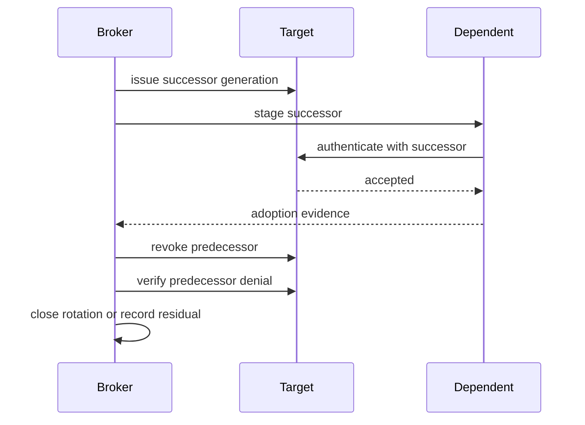

# Rotation, renewal, revocation, and reconciliation

**RM-SECRETS-ROTATE-0001:** A rotation plan binds current/successor generations, target, dependents, issuance method, compatibility/overlap, activation order, deadlines, health criteria, rollback/compensation, predecessor revocation, and authority.

**RM-SECRETS-ROTATE-0002:** Staged rotation distinguishes successor issued, stored, distributed, loaded, selected, target-accepted, healthy, issue path cut over, predecessor no longer selected, predecessor revoked, and denial verified.

**RM-SECRETS-ROTATE-0003:** Same-value republishing, metadata-only update, wrapping-key re-encryption, credential renewal, key rotation, target password change, certificate replacement, and account replacement are distinct operations.

**RM-SECRETS-ROTATE-0004:** Overlap is the minimum bounded interval required for safe adoption; products define which generations targets accept and dependents prefer. Rollback never re-enables a known-compromised predecessor.

**RM-SECRETS-ROTATE-0005:** Partial failure records each dependent and target outcome, continues safe retries with idempotency/fencing, escalates before expiry, and reports unverified or offline residuals.

**RM-SECRETS-ROTATE-0006:** Fleet scheduling uses jitter, rate/capacity budgets, expiry horizon, dependency order, maintenance windows, target limits, outage reserves, and emergency priority to avoid renewal storms.
