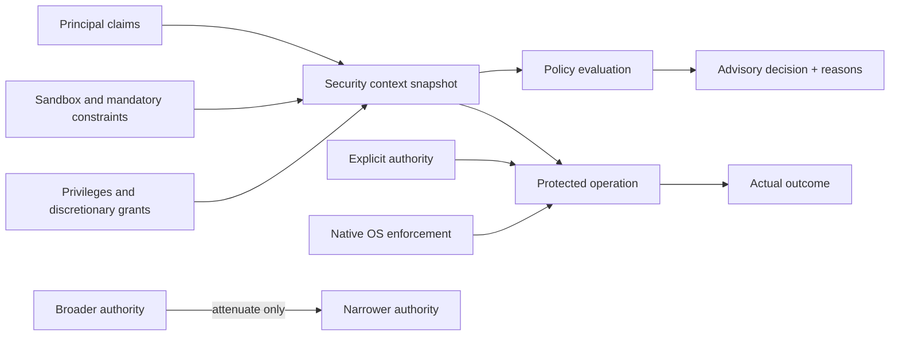
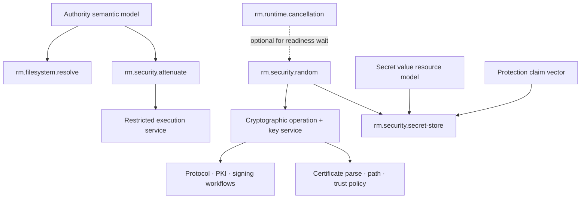

# Security and authority foundations vertical slice

| Field | Value |
|---|---|
| Status | Draft domain analysis |
| Purpose | Define portable authority, policy, isolation, and cryptographic-random semantics without pretending native security models are identical |

## Domain boundary

The security domain supplies semantic building blocks for least-authority operation. It does not replace Windows access checks, Linux credentials and security modules, macOS sandbox enforcement, application authorization policy, or specialist cryptographic protocols.

This slice establishes the authority vocabulary, authority attenuation, restricted-execution composition, secure random bytes, protected secret storage, cryptographic operation/key-management foundations, and certificate/trust-store/path-validation foundations. User authentication and credential brokering are specified in the identity-session slice; certificate issuance/lifecycle, protocol authentication, code/document signing, remote vault/HSM protocols, and product security policy remain separate compositions.

## Model

The protected operation—not a prior policy query—is the enforcement point. A principal describes who or what is acting; authority describes what an operation may attempt. Possessing an object that carries authority must not silently confer unrelated rights.

## Foundational rules

- Identity is not authority.
- Portable APIs take explicit authority where practical and avoid process-global ambient authority.
- Derivation is attenuation-only: narrower operations, resources, lifetime, audience, or delegation depth.
- Constraints compose by intersection; an allow from one source does not override a denial or missing grant from another.
- Native enforcement is authoritative. Preflight policy evaluation is advisory and race-prone.
- Denial is the safe default when required evidence, provider support, or policy is absent.
- Security context observations are scoped snapshots, not permanent truth or portable tokens.
- Diagnostics preserve useful native context but do not disclose secrets or sensitive policy internals by default.

## Initial graph

## Documents

- [Governed security promotion units](promotion-units.md)

- [Authority model](authority-model.md)
- [`rm.security.attenuate`](attenuation.md)
- [Authority-attenuation capability readiness dossier](attenuation-readiness-review.md)
- [Authority-attenuation assertion and benchmark traceability](attenuation-traceability.md)
- [Authority-attenuation dependency and service composition](attenuation-dependencies.md)
- [Authority-attenuation cross-cutting review](attenuation-cross-cutting-review.md)
- [Authority-attenuation source review](attenuation-source-review.md)
- [Authority-attenuation ownership and bounded trial plan](attenuation-ownership.md)
- [Authority delegation model](delegation-model.md)
- [Policy and decision model](policy-model.md)
- [Threat model](threat-model.md)
- [Platform research](platform-research.md)
- [`rm.security.random`](random.md)
- [Secure-random capability readiness dossier](random-readiness-review.md)
- [Secure-random assertion and benchmark traceability](random-traceability.md)
- [Secure-random dependency and profile composition](random-dependencies.md)
- [Secure-random cross-cutting review](random-cross-cutting-review.md)
- [Secure-random source review](random-source-review.md)
- [Secure-random ownership and bounded trial plan](random-ownership.md)
- [Secret value resource model](secret-value.md)
- [Secret protection claim model](secret-protection-model.md)
- [`rm.security.secret-store`](secret-store.md)
- [Secret storage platform research](secret-platform-research.md)
- [Restricted execution platform service](restricted-execution.md)
- [Conformance specification](conformance.md)
- [Benchmark specification](benchmarks.md)
- [Cross-domain security review checklist](review-checklist.md)
- [Cryptographic operations and key-management foundations](crypto-README.md)
- [Cryptographic algorithm suites and policy](crypto-policy.md)
- [Cryptographic key resources and lifecycle](crypto-keys.md)
- [Hash, MAC, and derivation](crypto-hash-mac-kdf.md)
- [Authenticated encryption](crypto-aead.md)
- [Signatures, verification, and agreement](crypto-public-key.md)
- [Key import, export, wrapping, and serialization](crypto-import-export.md)
- [Providers, hardware, attestation, and certification](crypto-providers-attestation.md)
- [Cryptographic operation lifecycle and quality](crypto-operations.md)
- [Cryptographic platform research](crypto-platform-research.md)
- [Cryptographic conformance](crypto-conformance.md)
- [Cryptographic benchmarks](crypto-benchmarks.md)
- [Certificate, trust-store, and PKI-validation foundations](pki-README.md)
- [Certificate parsing and evidence](pki-certificates.md)
- [Trust stores, anchors, and distrust](pki-trust-stores.md)
- [Path construction](pki-path-construction.md)
- [Path validation and policy](pki-path-validation.md)
- [Reference identity and name matching](pki-identity-matching.md)
- [Revocation, status, and freshness](pki-revocation.md)
- [PKI network retrieval and caching](pki-network-cache.md)
- [Trust results, overrides, and lifecycle](pki-results-lifecycle.md)
- [PKI platform research](pki-platform-research.md)
- [PKI conformance](pki-conformance.md)
- [PKI benchmarks](pki-benchmarks.md)

The secure-random dossier is capability-scoped. It does not constitute a security-domain promotion review: authority, restricted execution, secrets, cryptography, PKI, and issuance retain independent incomplete readiness evidence.
