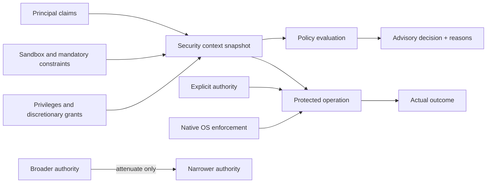
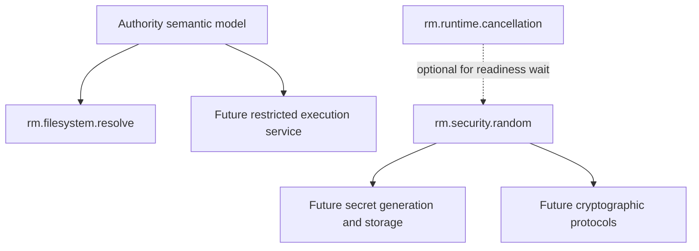

# Security and authority foundations vertical slice

| Field | Value |
|---|---|
| Status | Draft domain analysis |
| Purpose | Define portable authority, policy, isolation, and cryptographic-random semantics without pretending native security models are identical |

## Domain boundary

The security domain supplies semantic building blocks for least-authority operation. It does not replace Windows access checks, Linux credentials and security modules, macOS sandbox enforcement, application authorization policy, or specialist cryptographic protocols.

This slice establishes the authority vocabulary and one narrow, independently testable capability: cryptographically secure random bytes. Restricted-process construction, secret storage, user authentication, credential brokers, signing, and general cryptographic primitives remain later analyses.

## Model

The protected operation—not a prior policy query—is the enforcement point. A principal describes who or what is acting; authority describes what an operation may attempt. Possessing an object that carries authority must not silently confer unrelated rights.

## Foundational rules

- Identity is not authority.
- Portable APIs take explicit authority where practical and avoid process-global ambient authority.
- Derivation is attenuation-only: narrower operations, resources, lifetime, audience, or delegation depth.
- Constraints compose by intersection; an allow from one source does not override a denial or missing grant from another.
- Native enforcement is authoritative. Preflight policy evaluation is advisory and race-prone.
- Denial is the safe default when required evidence, provider support, or policy is absent.
- Security context observations are scoped snapshots, not permanent truth or portable tokens.
- Diagnostics preserve useful native context but do not disclose secrets or sensitive policy internals by default.

## Initial graph

## Documents

- [Authority model](authority-model.md)
- [Policy and decision model](policy-model.md)
- [Threat model](threat-model.md)
- [Platform research](platform-research.md)
- [`rm.security.random`](random.md)
- [Conformance specification](conformance.md)
- [Benchmark specification](benchmarks.md)

