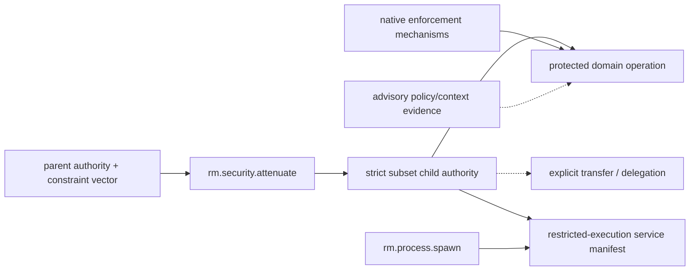

# Authority-attenuation dependency and service composition

**Status:** Reviewed capability composition  
**Scope:** `rm.security.attenuate` 0.1.0

The parent is a typed capability/resource input, not a stable dependency on one universal authority capability. Attenuation produces a narrower authority; the protected operation remains the enforcement point. Restricted execution composes attenuation and process creation but adds pre-execution isolation, inheritance, supervision, and verification that attenuation alone does not promise.

| Relationship | Type | Required boundary |
|---|---|---|
| parent authority → attenuation | typed input relationship | same authority kind; all comparable dimensions are intersected and expansions fail |
| child authority → protected operation | authorization input | operation performs authoritative native enforcement; policy preflight remains advisory |
| child → delegation/transfer | conditional service/protocol | explicit receiver/audience/depth/ownership/rejection/revocation semantics |
| attenuation + spawn → restricted execution | service composition | manifest applies and verifies required controls before child code; exact degradation policy |

Foundation profiles treat attenuation as optional until a selected capability/service needs derivation. When selected, the profile binds authority kinds, comparable dimensions, minimum claim vectors, aliases, lifecycle/transfer/revocation semantics, native contexts, and consuming operations/services. No OS name or sandbox label establishes an A-claim.

**RM-SECURITY-ATTENUATE-DEPENDENCY-0001:** A selecting profile/service MUST resolve exact authority kinds, constraint dimensions, native contexts, claim vectors, alias/bypass assumptions, lifecycle, transfer/delegation, revocation, and consumer-operation scope.

**RM-SECURITY-ATTENUATE-DEPENDENCY-0002:** Attenuation MUST NOT infer elevation, identity/authentication, universal serialization, sandbox creation, or revocation of aliases outside its declared control.

**RM-SECURITY-ATTENUATE-DEPENDENCY-0003:** Typed input/output, service composition, policy evidence, native enforcement, profile membership, and stable capability-graph edges MUST remain distinct relationships.

**RM-SECURITY-ATTENUATE-DEPENDENCY-0004:** A claim-vector match MUST NOT imply equivalent mechanisms, bypass resistance, deployment assumptions, transferability, revocation, or restricted-execution guarantees.
