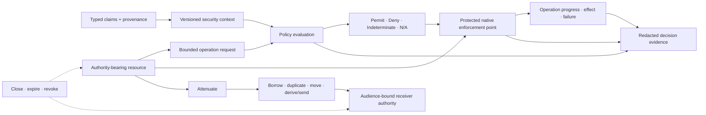

# Authority dependency and lifecycle composition

**Status:** Draft unit composition  
**Promotion unit:** `rm.promotion.security.authority`

## Relationship classification

| Relationship | Class | Rule |
|---|---|---|
| typed identity/claims → security context | Conditional input | claims retain issuer, namespace, generation, time, and uncertainty; identity is not authority |
| authority-bearing resource → operation | Required | the consuming domain defines resource identity, operations, milestones, and effect semantics |
| policy evaluation → enforcement | Advisory | permit cannot authorize by itself; deny/indeterminate may stop before the operation |
| attenuation → delegation | Conditional service | a child is bounded by the parent; derive-and-send is the portable default |
| authenticated transport → cross-context transfer | Conditional infrastructure | channel identity, audience, replay, commit, and ownership recovery are explicit |
| close/expiry/revocation → existing authorities | Conditional lifecycle | scope, aliases, propagation, partitions, in-flight operations, and residual effects are reported separately |
| restricted execution → authority unit | Consumer composition | the separate restricted-execution unit consumes authority/attenuation but owns pre-release isolation verification |
| observability/audit → authority unit | Cross-cutting service | evidence is sanitized and never substitutes for enforcement or domain truth |

Authority is a semantic protocol shared by domain-specific resource capabilities; it is not a universal native token, permission bitset, user identity, policy engine, or process sandbox. Filesystem handles, process controls, IPC endpoints, window/session resources, secrets, keys, and remote service grants keep their own resource and effect contracts.

**RM-SECURITY-AUTHORITY-DEPENDENCY-0001:** Every composition MUST identify which component owns identity evidence, authority construction, policy evaluation, native enforcement, domain effects, audit evidence, invalidation, and reconciliation.

**RM-SECURITY-AUTHORITY-DEPENDENCY-0002:** A conditional identity, policy, transport, runtime, sandbox, or revocation relationship MUST NOT become a universal required capability-graph edge without exact source declarations and profile review.

**RM-SECURITY-AUTHORITY-DEPENDENCY-0003:** Cross-provider or cross-process delegation MUST preserve typed authority semantics while reporting provider-specific transfer, alias, inheritance, enforcement, and revocation limitations.

**RM-SECURITY-AUTHORITY-DEPENDENCY-0004:** Policy permit, transfer acceptance, revocation request, audit publication, and operation success MUST retain separate identities and timestamps.

**RM-SECURITY-AUTHORITY-DEPENDENCY-0005:** Consumer profiles MUST select exact authority kinds, ambient-authority policy, delegation modes, enforcement claims, invalidation rules, and required failure behavior rather than selecting the security directory wholesale.
