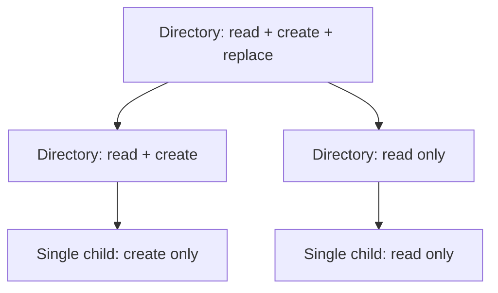

# Authority model

**Status:** Draft elaboration of the authoritative architecture model

## Vocabulary

| Term | Meaning | Not equivalent to |
|---|---|---|
| Principal | A named or pseudonymous actor about which scoped claims are made | Permission, human user, or universally stable identity |
| Principal claim | Issuer-scoped assertion about a principal, with provenance and validity context | An independently trusted fact |
| Security context | Snapshot of relevant principal claims, credentials, privileges, sandbox constraints, and provenance | Transferable authority or future access guarantee |
| Authority | Controlled ability to attempt a bounded operation on a resource or namespace | Identity, path string, policy decision, or guaranteed success |
| Grant | Policy or native state contributing permission | Sole determinant of access |
| Constraint | Limit that narrows otherwise available authority | A grant |
| Delegation | Transfer or derivation of authority to another execution context | Implicit inheritance of all caller rights |
| Attenuation | Irreversible narrowing within the portable model | Revocation or elevation |

Principal identifiers are typed by namespace and issuer. A Windows SID, Unix UID, code-signing identity, application package identity, and remote service subject must never compare equal merely because their display text matches.

## Authority descriptor

A portable authority descriptor records, when applicable:

- authority kind and contract version;
- resource or namespace scope;
- permitted operation set;
- constraints, including traversal or target-kind policy;
- validity bounds and revocation behavior;
- delegation and attenuation rules;
- issuer/provider provenance;
- audit correlation identifier that is not itself a secret.

The descriptor may be inspectable while the native authority remains opaque. Serialization is forbidden unless a capability explicitly defines secure export, authenticity, replay, confidentiality, and restoration semantics.

## Derivation lattice

For parent authority `A` and derived authority `B`, `B <= A` only when every operation, resource, time bound, audience, and delegation right in `B` is contained by `A`. Portable derivation must reject incomparable or broader requests.

Attenuation does not promise that all native aliases, inherited handles, duplicated descriptors, or already-started operations are revoked. Revocation scope and latency are separate contract properties.

## Ambient authority

Process credentials, environment, current directory, inherited native handles, and global stores are ambient inputs. Convenience layers may use them only under an explicit ambient-authority policy and must disclose that use. Base security-sensitive contracts should accept authority-bearing resources directly.

## Lifecycle

Authority resources have deterministic close/release where the native mechanism supports it, eventual cleanup on drop, explicit duplication rules, and defined behavior across process creation. A closed authority cannot authorize new operations. In-flight operations follow their own terminal-outcome contract.

