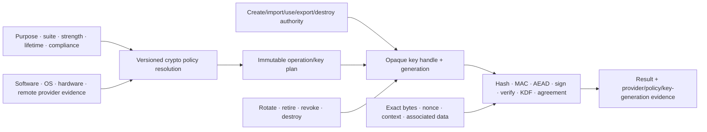

# Cryptographic operations and key-management foundations

| Field | Value |
|---|---|
| Status | Draft domain analysis |
| Purpose | Provide typed, policy-bound cryptographic operations over opaque keys while preserving algorithm, provider, lifecycle, hardware, certification, and authority evidence |

## Conclusions

- Algorithm, parameters, operation purpose, key usage, key origin, storage/protection, provider, certification boundary, and protocol are separate dimensions.
- Private and symmetric keys are opaque operation capabilities by default. A key handle authorizes only explicitly granted operations and never implies export.
- Algorithm policy is versioned workload input resolved before key creation/use. Provider defaults and installed-algorithm names are not portable security policy.
- Hash, MAC, AEAD, signature, verification, key derivation, password derivation, key agreement, wrapping, import/export, attestation, and protocol composition have distinct contracts.
- Nonce, salt, context, associated-data, domain-separation, encoding, streaming, finalization, and failure behavior are exact and test-vector visible.
- “Hardware-backed,” “non-exportable,” “constant time,” “approved,” and certification claims identify the exact provider/module/operation/configuration/evidence boundary and never become a universal quality level.

## Documents

- [Algorithm suites and policy](crypto-policy.md)
- [Key resources, authority, and lifecycle](crypto-keys.md)
- [Hash, MAC, and derivation](crypto-hash-mac-kdf.md)
- [Authenticated encryption](crypto-aead.md)
- [Signatures, verification, and agreement](crypto-public-key.md)
- [Import, export, wrapping, and serialization](crypto-import-export.md)
- [Providers, hardware, attestation, and certification](crypto-providers-attestation.md)
- [Operations, buffers, concurrency, and failure](crypto-operations.md)
- [Platform research](crypto-platform-research.md)
- [Conformance](crypto-conformance.md)
- [Benchmarks](crypto-benchmarks.md)
