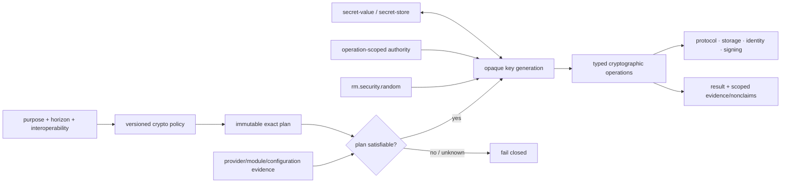

# Cryptography and key-management dependency and profile composition

**Status:** Reviewed promotion-unit composition  
**Scope:** `rm.promotion.security.cryptography`

| Relationship | Type | Required boundary |
|---|---|---|
| random → key generation/nonces/salts | operation-conditional capability consumption | exact consumer role, size, uniqueness/allocation owner, lifecycle, and failure remain algorithm/protocol policy; random bytes alone are not a key/nonce guarantee |
| authority/attenuation → keys/operations | semantic/resource composition | create/import/open/use/export/rotate/revoke/destroy are distinct purpose/audience/principal/lifetime/use-count/provider grants |
| secret-value/store ↔ crypto | resource/provider composition | import/export and software material use preserve exposure; opaque store references imply non-reveal only for a named common provider-mediated operation |
| provider/module/hardware/remote service → crypto | provider prerequisite | exact algorithm, operation, key boundary, artifact, configuration/mode, self-test, availability, fallback, attestation, and certification evidence |
| crypto → protocols/PKI/artifact signing/storage | consumer composition | consumers own transcript/format/trust/identity/replay/freshness/publication semantics and cannot inherit them from primitive validity |
| cancellation/time/async framework → crypto | conditional lifecycle composition | only materially waiting/remote/interactive operations compose them; accepted provider work, use counters, and unknown outcomes remain truthful |

Profiles constrain purpose, algorithm suites/parameters/encodings, transition dates, provider/protection/export/certification, interaction, performance/size, availability, failure, and evidence. No profile may select “best available,” infer approval from an installed algorithm name, or silently migrate a non-exportable/hardware-bound key.

**RM-CRYPTO-DEPENDENCY-0001:** A selecting profile MUST resolve exact policy/workload generation, algorithms/parameters/encodings, key origin/lifecycle/usage/export, provider/module/artifact/platform/hardware/configuration/mode, interaction, availability, transition, failure, and evidence policy.

**RM-CRYPTO-DEPENDENCY-0002:** Provider discovery MUST be side-effect-free; immutable policy resolution and constraint satisfaction MUST precede key creation/import/open and operation activation, with no automatic substitution or “best available” fallback.

**RM-CRYPTO-DEPENDENCY-0003:** Randomness, authority, secret exposure/storage, cancellation, time, async, and provider composition MUST preserve their own semantics and MUST NOT strengthen bytes, handles, references, cancellation requests, or mechanism names into cryptographic guarantees.

**RM-CRYPTO-DEPENDENCY-0004:** Cryptographic validity MUST NOT imply identity, trust, authorization, freshness, intent, protocol safety, artifact acceptance, publication, installation, or execution; those remain consumer contracts.

**RM-CRYPTO-DEPENDENCY-0005:** Internal operation families share policy/key/provider/release ownership and remain one promotion unit, while their distinct contracts, assertions, vectors, benchmarks, and compatibility surfaces MUST NOT be collapsed into a generic encrypt/sign API.
