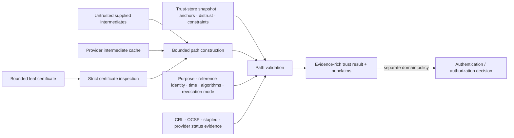

# Certificate, trust-store, and PKI-validation foundations

| Field | Value |
|---|---|
| Status | Draft domain analysis |
| Purpose | Parse certificate evidence, construct and validate paths under explicit policy, match typed reference identities, and report freshness/revocation quality without confusing signatures, trust, identity, or authorization |

## Conclusions

- DER/PEM parsing, certificate inspection, path construction, path validation, reference-identity matching, revocation/status, transparency, trust-store administration, issuance, and authorization are distinct capabilities or services.
- A peer-supplied list is an unordered untrusted certificate bag, not a validated chain. Construction may find zero, one, or many candidate paths.
- Trust anchors, intermediates, leaf certificates, explicit distrust, purpose constraints, enterprise/user overrides, and provider policy metadata remain distinct and generation-scoped.
- A trust result binds exact leaf bytes, selected path, purpose, typed identity reference, validation time source, trust snapshot, algorithm policy, revocation/network mode, provider/version, and all unknowns.
- Certificate signature validity does not prove issuance legitimacy, subject identity, current control of the private key, authorization, freshness, or semantic content integrity.
- Online retrieval is explicit bounded I/O with privacy, recursion, redirect, proxy, cache, cancellation, and denial-of-service policy; offline and unknown are first-class outcomes.

## Documents

- [Certificate parsing and evidence](pki-certificates.md)
- [Trust stores, anchors, and distrust](pki-trust-stores.md)
- [Path construction](pki-path-construction.md)
- [Path validation and policy](pki-path-validation.md)
- [Reference identity and name matching](pki-identity-matching.md)
- [Revocation, status, and freshness](pki-revocation.md)
- [Network retrieval and caching](pki-network-cache.md)
- [Results, overrides, and lifecycle](pki-results-lifecycle.md)
- [Platform research](pki-platform-research.md)
- [Conformance](pki-conformance.md)
- [Benchmarks](pki-benchmarks.md)
