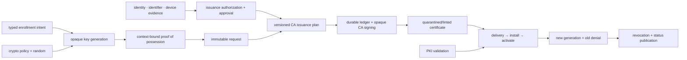

# PKI-issuance dependency and profile composition

**Status:** Reviewed promotion-unit composition  
**Scope:** `rm.promotion.security.pki-issuance`

| Relationship | Type | Required boundary |
|---|---|---|
| authority/identity/proofing → enrollment | evidence/semantic composition | subject/requester/agent, identifiers/profile/purpose, exact method/freshness, approval/delegation, rate/quantity, renewal/revocation grants remain independent |
| crypto/random/secret protection → keys/POP/signing | capability/provider composition | exact plans, nonce/challenge, opaque keys, operation authority, exposure, provider/hardware/remote/certification and lifecycle evidence |
| networking/secure channels/time → protocols/challenges | conditional service composition | authenticated endpoint/account/channel, replay/redirect/proxy/SSRF, deadlines/clocks, retry/poll/idempotency, ambiguity and privacy remain explicit |
| PKI validation → response/install/issuer checks | separate-unit evidence consumption | bounded parsing, request/public-key binding, selected enrollment-purpose trust policy, candidate-chain handling, status and nonclaims; validation cannot authorize issuance |
| stores/filesystem/services → install/activation | provider/service composition | exact key association, principal/scope/access/export, atomicity/durability, distribution/readiness/health/overlap/rollback and cache/session behavior |
| CA ledger/HSM/status/CT/audit → issuance | privileged platform-service composition | serial/transaction durability, quorum/role separation, release prerequisites, public-log/privacy, status publication, failover/recovery and certification scope |

Profiles select exact subject/workload, operation kind, certificate profile/identifiers/purpose, key/provider/protection, authority/proofing/approval, issuer/protocol/server trust, target store/service, interaction/deadline, renewal/revocation, CA operational controls, and evidence. No provider or protocol may collapse issuance into a single success flag.

**RM-PKI-ISSUANCE-DEPENDENCY-0001:** A selecting profile MUST bind exact operation/subject/requester, key/POP/attestation, authority/proofing/identifier/approval, issuer/profile/policy, protocol/server/account/network/time, store/scope/service/activation, renewal/revocation, CA ledger/key/status/CT/audit/recovery, and evidence policy.

**RM-PKI-ISSUANCE-DEPENDENCY-0002:** POP, request signature, attestation, account/device authentication, identifier control, template name, and prior credential possession MUST NOT imply issuance authority or authorize requested certificate fields.

**RM-PKI-ISSUANCE-DEPENDENCY-0003:** Protocol acceptance, challenge success, CA approval, signing, response delivery, installation, private-key association, activation, health, status publication, and relying-party trust/authorization MUST remain separately reconciled milestones.

**RM-PKI-ISSUANCE-DEPENDENCY-0004:** Renewal guidance—including ACME ARI—is authenticated scheduling input rather than execution authority; clients retain policy, randomization, retry/outage budget, applicability, deadline, replacement, and old-credential retirement responsibility.

**RM-PKI-ISSUANCE-DEPENDENCY-0005:** Issuance depends on validation/cryptography evidence but remains a separate promotion and authority boundary; neither unit's maturity, provider result, waiver, certification, or release claim transfers implicitly.
