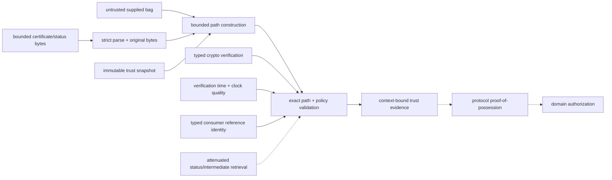

# PKI-validation dependency and profile composition

**Status:** Reviewed promotion-unit composition  
**Scope:** `rm.promotion.security.pki-validation`

| Relationship | Type | Required boundary |
|---|---|---|
| crypto → certificate/status signatures | operation consumption | exact algorithms/parameters/encodings/keys/policy and cryptographic validity; no trust/identity/authorization inference |
| time/clock → validity/status/result expiry | semantic/capability composition | selected instant, domain, uncertainty/quality, historical/current policy, and dependency expiry remain explicit |
| trust providers/stores → validation | provider/policy input | immutable provenance-bearing anchors/distrust/constraints/overrides snapshot; store membership is not trust by itself |
| network/DNS/proxy/cache → intermediates/status | conditional service composition | separately authorized bounded retrieval; locators are untrusted and no hidden I/O or general network authority is created |
| authority/attenuation → retrieval/store administration/overrides | semantic/resource composition | observe, retrieve, mutate trust, create exceptions, pin, and disclose sensitive diagnostics are distinct grants |
| trust result → channels/identity/artifact consumers | evidence consumption | consumer supplies exact purpose/profile/reference identity, proof-of-possession/transcript/freshness, pins, and authorization/acceptance policy |

Profiles resolve exact trust sources/precedence, purpose, identity profile, verification time, algorithm policy, status/network/cache mode, provider requirements, pins/overrides, privacy, and failure behavior. A profile cannot infer a chain from presentation order, a trust anchor from self-signature/store membership, `good` from unavailable status, or authorization from a successful validation result.

**RM-PKI-DEPENDENCY-0001:** A selecting profile MUST bind exact certificate/status format and limits, RFC/profile update set, trust sources/snapshot/precedence, construction/validation policy, purpose/reference identity, time/clock, algorithm policy, status/network/cache, provider, pins/overrides, privacy, result expiry, and consumer nonclaims.

**RM-PKI-DEPENDENCY-0002:** Parsing and inspection MUST remain side-effect-free; network acquisition, trust-store mutation, private-key access, prompting, exceptions, and authorization require separately composed authority/services.

**RM-PKI-DEPENDENCY-0003:** Cryptographic signature validity, issuer-name relationship, path existence, path validation, identity match, status evidence, protocol proof-of-possession, account mapping, and authorization MUST NOT strengthen one another implicitly.

**RM-PKI-DEPENDENCY-0004:** Online retrieval is conditional, async-first bounded I/O; sync validation MUST use explicit offline/cache-only policy or a finite deadline and MUST report whether network/cache evidence affected the result.

**RM-PKI-DEPENDENCY-0005:** Validation and issuance remain separate promotion units: validation consumes certificates/status/trust evidence but cannot authorize enrollment, issuance, renewal, revocation requests, CA operations, or certificate publication.
