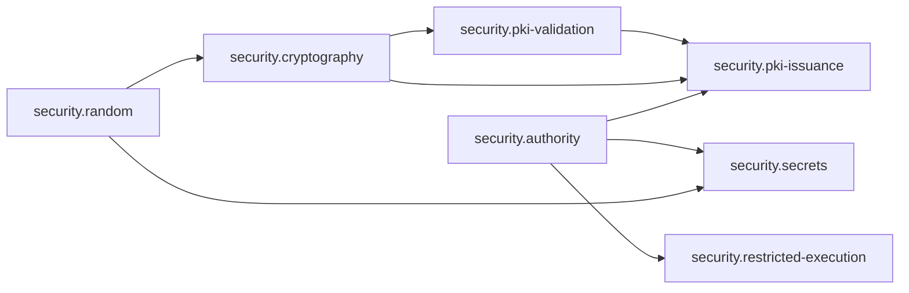

# Security governed promotion units

**Status:** Accepted boundary registry  
**Decision:** [ADR-0163](../../adr/0163-maturity-promotion-units-follow-evidence-boundaries-not-directory-layout.md)  
**Directory maturity:** Draft aggregate; no child maturity is inherited

| Unit | Maturity | Accountable role | Primary specification | Boundary summary |
|---|---|---|---|---|
| `rm.promotion.security.authority` | Draft | Authority semantics owner | [Authority model](authority-model.md) | Authority/policy context, attenuation, delegation, provenance, enforcement claims, and revocation semantics |
| `rm.promotion.security.restricted-execution` | Draft | Restricted-execution owner | [Restricted execution](restricted-execution.md) | Pre-execution deny-by-default isolation manifest, process composition, verification, degradation, supervision, and cleanup |
| `rm.promotion.security.random` | Draft | Secure-random capability owner | [Secure random](random.md) | Exact-fill OS cryptographic randomness, readiness/failure, output secrecy, lifecycle, and scoped provider claims |
| `rm.promotion.security.secrets` | Draft | Secret-protection owner | [Secret store](secret-store.md) | Secret-value ownership, protection vectors, native storage, interaction, scoped reveal/use, update/delete, and lifecycle |
| `rm.promotion.security.cryptography` | Draft | Cryptography and key-management owner | [Cryptographic foundations](crypto-README.md) | Policy-selected algorithms, opaque keys, operations, import/export, providers/hardware/attestation, conformance, and performance |
| `rm.promotion.security.pki-validation` | Draft | PKI validation owner | [PKI validation foundations](pki-README.md) | Certificate parsing, trust stores, path construction/validation, identity matching, revocation/network evidence, and result lifecycle |
| `rm.promotion.security.pki-issuance` | Draft | Certificate issuance owner | [PKI issuance foundations](pki-issuance-README.md) | Issuance authority/policy, requests/enrollment/protocols, CA operations, renewal, security/accessibility, conformance, and performance |

Arrows are domain composition and evidence order, not automatically capability-graph dependencies. Exact stable edges still require source declarations.

## Shared evidence policy

`README.md`, `authority-model.md`, `threat-model.md`, `platform-research.md`, `review-checklist.md`, and some conformance/benchmark material may support multiple units. Each unit's traceability map identifies the exact propositions it consumes. A shared file is not a shared pass.

## Boundary rationale

| Unit | Distinct forcing function |
|---|---|
| Authority | foundational semantic model spans provider kinds; correctness is subset/enforcement/lifecycle rather than cryptographic validation |
| Restricted execution | cross-domain process/isolation service with high-risk pre-execution and cleanup boundary |
| Random | small provider API with lifecycle and source provenance; consumed widely but independently versionable |
| Secrets | interactive/native-store lifecycle, exposure, replication/backup/delete, and product protection claims |
| Cryptography | algorithm policy, key lifecycle, hardware/provider and certification evidence, vector interoperability |
| PKI validation | external certificate/trust/revocation/network standards and consumer-qualified validation policy |
| PKI issuance | privileged CA governance, enrollment protocols, ceremonies, audit, renewal, and higher operational risk |

All units remain Draft. Existing capability dossiers for [random](random-readiness-review.md) and [attenuation](attenuation-readiness-review.md) are evidence within their units, not accepted maturity decisions.

**RM-SECURITY-UNIT-0001:** Security unit maturity MUST be decided independently and MUST NOT inherit from directory status, another unit, or a shared provider/library.

**RM-SECURITY-UNIT-0002:** Cross-unit compositions MUST bind exact compatible versions, authority flow, algorithm/provider policy, lifecycle, evidence, and failure boundaries without creating inferred graph edges.

**RM-SECURITY-UNIT-0003:** Unit partitioning MUST NOT select filesystem layout, crates, repositories, packages, provider libraries, or release topology.
