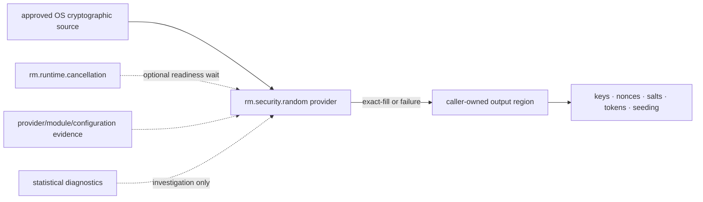

# Secure-random dependency and profile composition

**Status:** Reviewed capability composition  
**Scope:** `rm.security.random` 0.1.0

The approved OS source is a provider prerequisite, not another Rusty Mill capability. Cancellation is optional only for a material readiness wait; normal fill has no universal async/runtime dependency. Consumers receive bytes but do not inherit a guarantee about key construction, nonce uniqueness policy, token encoding, password generation, or certification.

| Relationship | Type | Required boundary |
|---|---|---|
| random → cancellation | optional capability edge | readiness waiting only; request/terminal cancellation semantics preserved |
| OS cryptographic source → provider | native provider prerequisite | exact API/module/configuration/platform and fail-closed behavior declared |
| random → crypto/secret/identity consumers | output consumption | consumer owns purpose-specific size, derivation, uniqueness, lifetime, storage, and zeroization policy |
| statistical test → provider evidence | diagnostic relationship | may trigger investigation; cannot certify unpredictability or correct source use |

All foundation profiles require `rm.security.random >=0.1.0,<0.2.0`, fail closed, and require source readiness before secret-dependent work. Profile satisfaction binds an exact provider/module/configuration/platform/lifecycle frontier and cannot be inferred merely from operating-system identity.

**RM-SECURITY-RANDOM-DEPENDENCY-0001:** A selecting profile MUST resolve exact provider/module/configuration/platform, readiness, failure, lifecycle, diagnostic, and certification-claim policy.

**RM-SECURITY-RANDOM-DEPENDENCY-0002:** Optional cancellation MUST NOT create a hidden runtime dependency or turn normal fill into an inherently asynchronous operation.

**RM-SECURITY-RANDOM-DEPENDENCY-0003:** Consumer use MUST NOT strengthen random output into a key, nonce, salt, token, password, identifier, or certification guarantee without its own contract.

**RM-SECURITY-RANDOM-DEPENDENCY-0004:** Statistical observations, source names, and profile membership MUST NOT substitute for provider provenance, fail-closed integration evidence, or capability conformance.
