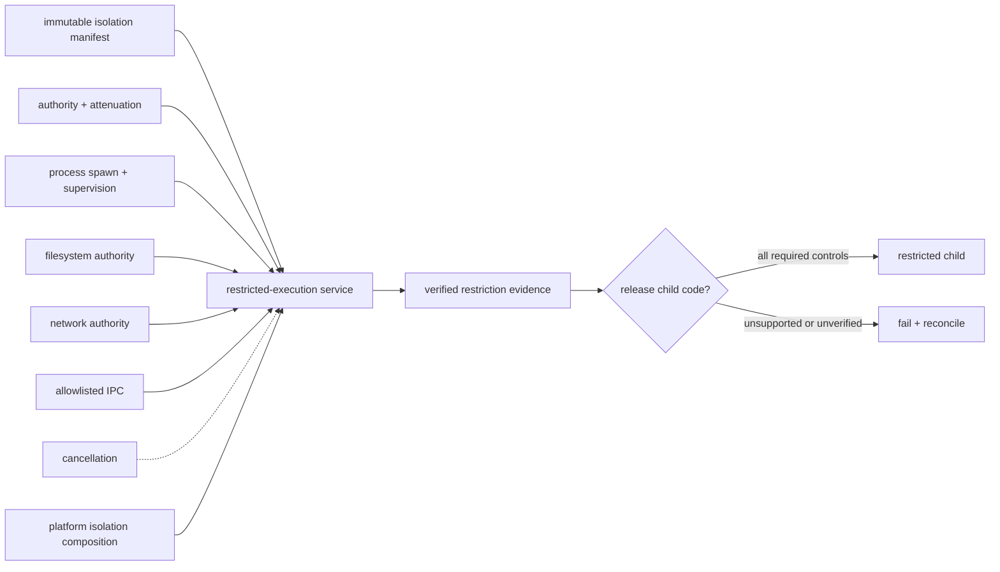

# Restricted-execution dependency and profile composition

**Status:** Reviewed promotion-unit composition  
**Scope:** `rm.promotion.security.restricted-execution`

| Relationship | Type | Required boundary |
|---|---|---|
| process spawn/supervision → restricted execution | service composition | owned-child creation, suspended/controlled release, readiness, descendant policy, termination, reaping, and accounting |
| authority/attenuation → restricted execution | semantic/resource composition | transferred authority is a proven subset; ambient native aliases and residual assumptions remain disclosed |
| filesystem/network → restricted execution | manifest subject relationship | exact allowed resources/operations and provider enforcement are resolved; no path/address string itself grants authority |
| IPC → restricted execution | optional resource composition | only explicit endpoints cross the boundary; inheritance, peer identity, capacity, and close behavior remain declared |
| cancellation → restricted execution | optional capability edge | cancellation has milestone-specific confirmed/indeterminate outcomes and cannot leave an unrestricted child |
| native mechanisms → restricted execution | provider prerequisite | exact mechanisms form one verified composition; mechanism names do not independently prove the portable outcome |

A selecting profile states the required isolation outcomes, minimum acceptable enforcement, explicitly permitted degradation classes, supported child workloads, and supervision policy. It cannot infer restricted execution from process support, sandboxed packaging, a container, a token, a namespace, entitlements, or any single native mechanism.

**RM-SECURITY-RESTRICTED-DEPENDENCY-0001:** A selecting profile MUST resolve exact manifest schema/version, provider composition, platform frontier, required enforcement, permitted degradation, readiness, descendant, failure, cancellation, audit, and cleanup policy.

**RM-SECURITY-RESTRICTED-DEPENDENCY-0002:** Process creation MUST NOT imply restricted execution; required restrictions and inheritance MUST be verified before application-controlled child code is released.

**RM-SECURITY-RESTRICTED-DEPENDENCY-0003:** Optional cancellation, IPC, filesystem, network, and observability composition MUST preserve each capability's authority, ownership, milestone, and terminal-outcome contracts without introducing ambient access.

**RM-SECURITY-RESTRICTED-DEPENDENCY-0004:** A degraded plan is a separately authorized manifest outcome with exact disclosed deltas and MUST NOT arise from provider fallback after authority has been prepared or child code released.

**RM-SECURITY-RESTRICTED-DEPENDENCY-0005:** Provider/framework relationships in this document MUST NOT be converted into universal capability-graph dependencies unless exact stable endpoints and selection conditions are separately declared.
