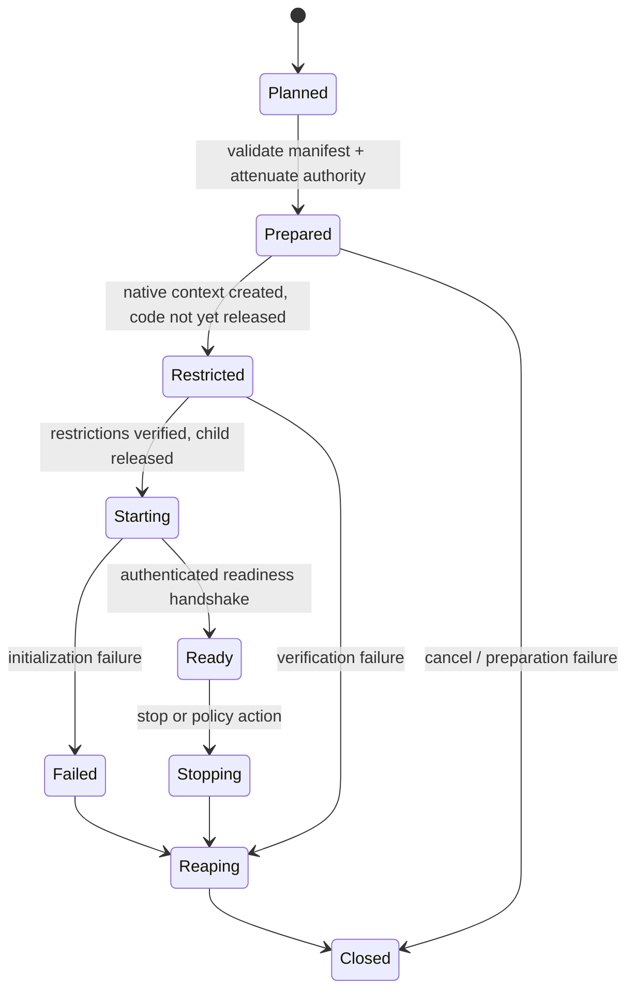

# Restricted execution platform service

| Field | Value |
|---|---|
| Status | Draft service contract |
| Contract version | 0.1.0 |
| Layer | Platform services |

## Purpose

Create and supervise a child execution context whose accessible resources and operations match an explicit authority manifest, using the strongest truthful native isolation available under policy.

This is a platform service because the outcome coordinates process creation, identity/credentials, authority attenuation, handle/file-descriptor inheritance, filesystem and network policy, sandbox mechanisms, startup handshake, observability, and lifecycle cleanup.

## Isolation manifest

The immutable manifest declares executable identity, arguments/environment disclosure policy, filesystem and network authority, inherited communication channels, credential/identity target, sandbox constraints, resource limits, child/delegation policy, observability boundary, required enforcement level, and permitted degradations.

Unlisted authority is denied by default. Process environment, current directory, inherited descriptors/handles, user profile access, network access, debug/control rights, and parent IPC are never inherited merely for convenience.

## Requirements

- **RM-SECURITY-RESTRICTED-0001:** Construction **MUST** resolve the complete manifest and required provider evidence before executing application-controlled child code.
- **RM-SECURITY-RESTRICTED-0002:** A required constraint that cannot be enforced at the requested level **MUST** make construction fail unless the manifest explicitly permits the reported degradation.
- **RM-SECURITY-RESTRICTED-0003:** The service **MUST** use an atomic-or-suspended launch sequence so the child cannot run unrestricted between creation and policy application.
- **RM-SECURITY-RESTRICTED-0004:** Inherited handles, descriptors, environment, working directory, signals/control channels, and parent relationship **MUST** be allowlisted.
- **RM-SECURITY-RESTRICTED-0005:** Authority transferred to the child **MUST** satisfy `rm.security.attenuate` and the delegation model.
- **RM-SECURITY-RESTRICTED-0006:** The result **MUST** disclose exact enforced constraints, enforcement levels, degradations, native mechanism classes, and residual ambient assumptions.
- **RM-SECURITY-RESTRICTED-0007:** Launch failure or cancellation **MUST** terminate or retain the child in a non-executing state and reclaim prepared authority without ambiguous ownership.
- **RM-SECURITY-RESTRICTED-0008:** A readiness handshake **MUST** distinguish native process creation from successful restriction and application initialization.
- **RM-SECURITY-RESTRICTED-0009:** Supervision **MUST** define termination, descendant handling, resource cleanup, and behavior when the supervisor fails.
- **RM-SECURITY-RESTRICTED-0010:** Audit output **MUST** identify policy and evidence without logging secrets, credential material, or unrestricted child input.

## State model

## Platform direction

- **Windows:** explicit handle list, restricted token and/or AppContainer/LPAC, mitigations, job object, suspended creation where needed, then verified release.
- **Linux:** allowlisted descriptors, credentials/capabilities, namespaces, `no_new_privs`, seccomp, LSM context, cgroup/resource policy, and a controlled fork/clone/exec handshake.
- **macOS:** App Sandbox entitlements fixed at signing, sandbox-aware helper/XPC boundaries, allowlisted descriptors, process controls, and security-scoped resources where applicable.

These ingredients are not interchangeable. A profile states outcomes and minimum enforcement; provider evidence explains the native composition and gaps.

