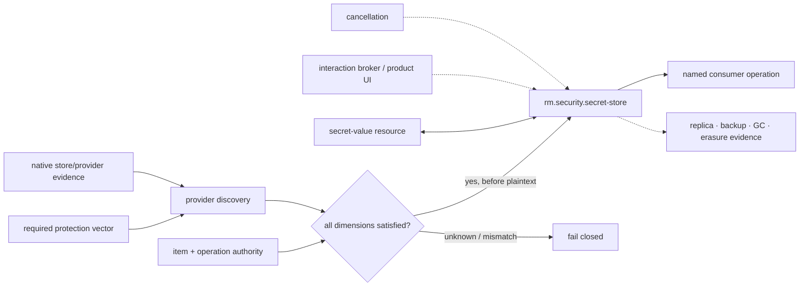

# Secret-protection dependency and profile composition

**Status:** Reviewed promotion-unit composition  
**Scope:** `rm.promotion.security.secrets`

| Relationship | Type | Required boundary |
|---|---|---|
| authority/attenuation → secret store | semantic/resource composition | separate create/read/reveal/export/replace/delete/enumerate authority; identifiers and lookup attributes never authorize |
| secret-value model ↔ secret store | resource model | owned/borrowed/opaque material, explicit exposure, lifetime, cleanup, and nonclaims remain distinct from persistence |
| interaction/UI → secret store | conditional service composition | discovery declares prompt policy; provider and product interaction remain accessible, non-spoofable, and asynchronous when material |
| cancellation → secret store | optional capability edge | wait may stop, but accepted provider work is reconciled as canceled/completed/indeterminate without fabricated state |
| filesystem → protected-blob provider | conditional provider responsibility | application-owned metadata, integrity context, generations, atomic publication, authority, backup, rollback, and cleanup are explicit |
| secret store → crypto/identity/network consumers | resource/operation consumption | consumers own purpose, algorithm/protocol, target/audience, exposure, rotation, and operation-specific non-reveal contracts |

Desktop selection may permit an accessible foreground prompt. CLI and server selection prohibit prompts and desktop-session dependence. No profile may infer a provider, protection strength, exportability, backup policy, or deletion effect solely from the operating system or mechanism name.

**RM-SECURITY-SECRET-DEPENDENCY-0001:** A selecting profile MUST resolve exact store/provider/item class, protection vector, account/session/sandbox state, interaction, exposure, generation, replication/backup, lifecycle, failure, cancellation, audit, and deletion policy.

**RM-SECURITY-SECRET-DEPENDENCY-0002:** Provider discovery and claim matching MUST precede plaintext submission where possible; mismatch or unknown MUST fail without plaintext fallback, transient file, environment, argument, clipboard, or diagnostic exposure.

**RM-SECURITY-SECRET-DEPENDENCY-0003:** Sync completeness applies only when the selected operation cannot materially wait or prompt. Conditional async/interaction support MUST NOT create a hidden universal runtime or allow unsafe UI-thread blocking.

**RM-SECURITY-SECRET-DEPENDENCY-0004:** Storage references, protected blobs, handles, and provider identity MUST NOT imply opaque use; only a named provider-mediated operation satisfying ADR-0133 may claim use without reveal.

**RM-SECURITY-SECRET-DEPENDENCY-0005:** Provider, service, resource, semantic, consumer, and profile relationships MUST remain classified and MUST NOT become universal capability-graph edges without exact source declarations.
