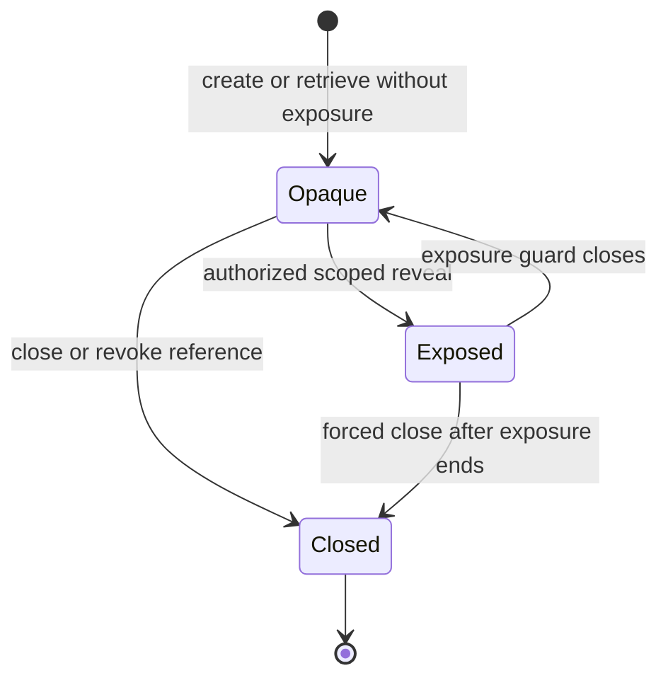

# Secret value resource model

**Status:** Draft semantic model; not an independent capability

## Purpose

A secret value is caller- or provider-owned sensitive byte material with explicit exposure, lifetime, duplication, and cleanup rules. It is a resource model used by capabilities; it does not claim that ordinary process memory can be made universally secret.

## States

The underlying provider may keep an opaque secret outside application memory and perform operations with it. When bytes must be revealed, exposure is explicit, short-lived, non-cloneable by default, and bounded to a caller-supplied operation.

## Semantic rules

- Secret values are not `String`; arbitrary bytes are valid and text interpretation is explicit.
- Debug, display, serialization, equality, hashing, cloning, and crash-dump inclusion are denied by default.
- Metadata such as label, class, timestamps, size, and lookup attributes may itself be sensitive and has separate disclosure policy.
- A reveal operation grants temporary read access; it does not transfer ownership or authorize persistence.
- Memory zeroization is best-effort unless exact compiler, allocator, paging, copying, dump, and hardware behavior is evidenced.
- Memory locking and no-dump flags are optional defenses with quotas and platform variance, not proof that plaintext never leaves physical memory.
- Closing a reference prevents new use through that reference but cannot erase copies previously made by a consumer or provider.
- Constant-time behavior is claimed only for a named operation and threat model; generic secret storage does not imply it.

## Exposure modes

| Mode | Meaning |
|---|---|
| Opaque use | Provider performs a named operation without returning plaintext |
| Scoped reveal | Plaintext is available only inside a bounded call/guard |
| Owned export | Caller receives an owned secret buffer; requires explicit export authority and policy |

Opaque use is preferred when the store and downstream operation can share a provider boundary. Owned export is never inferred from read authority.

## Lifecycle disclosures

Providers state whether plaintext can appear in application heap, provider process, kernel memory, swap/pagefile, crash dumps, hibernation images, backups, synchronization services, hardware security boundaries, or diagnostic capture. “Hardware-backed” identifies the protected operation and key material that remain inside the hardware boundary; it does not imply application plaintext never exists.

