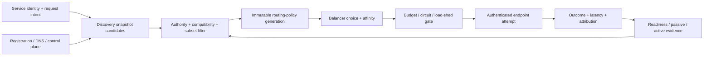

# Service discovery, traffic routing, and load-balancing foundations

| Field | Value |
|---|---|
| Status | Draft domain analysis |
| Purpose | Resolve versioned service intent into authorized endpoint attempts under explicit health, routing, load, locality, failover, and propagation policy |

## Conclusions

- Service identity, endpoint identity, endpoint location, discovery record, health observation, route, connection, and application instance are different scopes.
- Health/readiness is expiring boundary-scoped evidence, not a guarantee of request success or domain correctness.
- Routing binds one immutable policy generation and endpoint snapshot; discovery ordering and weights are inputs rather than ambient authority.
- Retries, hedges, failover, and connection reuse consume shared attempt/effect budgets and preserve original authority and deadlines.
- Configuration acceptance, local application, fleet propagation, traffic shift, and observed outcomes are separate milestones.

## Documents

- [Model, entities, and milestones](model.md)
- [Service and endpoint identity](identity.md)
- [Registration, leases, and discovery](registration-discovery.md)
- [Health, readiness, draining, and outliers](health.md)
- [Routing policy and subsets](routing.md)
- [Load-balancing algorithms and affinity](balancing-affinity.md)
- [Attempts, retries, hedges, and admission](attempts-admission.md)
- [Locality, failover, and recovery](locality-failover.md)
- [Control-plane lifecycle and propagation](control-plane.md)
- [Security and privacy](security-privacy.md)
- [Cross-cutting qualities](cross-cutting.md)
- [Platform and provider research](platform-research.md)
- [Conformance](conformance.md)
- [Benchmarks](benchmarks.md)

## Decisions

- [ADR-0114: Health is expiring evidence, not success authority](../../adr/0114-health-is-expiring-evidence-not-success-authority.md)
- [ADR-0115: Routing binds a policy generation and endpoint snapshot](../../adr/0115-routing-binds-a-policy-generation-and-endpoint-snapshot.md)

## Boundary

This domain composes networking, secure channels, HTTP/realtime, messaging/RPC, coordination, configuration, observability, and lifecycle. It does not choose product services, identities, protocols, discovery/control-plane providers, balancing algorithms, topology, rollout policy, service objectives, or retry/effect safety; products select those through RFCs.
