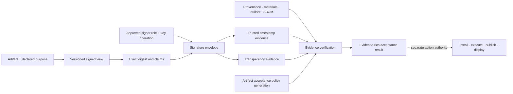

# Signed-artifact and provenance foundations

| Field | Value |
|---|---|
| Status | Draft domain analysis |
| Purpose | Produce and evaluate signed code, packages, documents, metadata, and attestations without confusing cryptographic validity with authorization or safety |

## Conclusions

- A signature binds a versioned, format-specific signed view and declared intent; every excluded or mutable byte region is explicit.
- Signer identity, key possession, certificate trust, trusted time, transparency inclusion, provenance, reproducibility, notarization/reputation, and authorization are independent evidence dimensions.
- Signing is an authority-bearing workflow with immutable plans, review, least-privilege key operations, auditable ceremony, and fail-closed policy.
- Verification returns an immutable result and nonclaims. It never means “safe,” “malware-free,” “approved to install,” or “authorized to execute” unless a separate policy establishes that conclusion.
- Native formats remain native: Authenticode, Apple code signatures/notarization, Linux package/repository formats, CMS, COSE, and DSSE/Sigstore are mapped rather than flattened.

## Documents

- [Artifact model and signed views](artifact-model.md)
- [Signing workflow and envelopes](signing-workflow.md)
- [Timestamping and transparency](timestamp-transparency.md)
- [Provenance and reproducibility](provenance-reproducibility.md)
- [Verification policy and lifecycle](verification-lifecycle.md)
- [Platform and format research](platform-research.md)
- [Security, privacy, and accessibility](security-accessibility.md)
- [Conformance](conformance.md)
- [Benchmarks](benchmarks.md)

