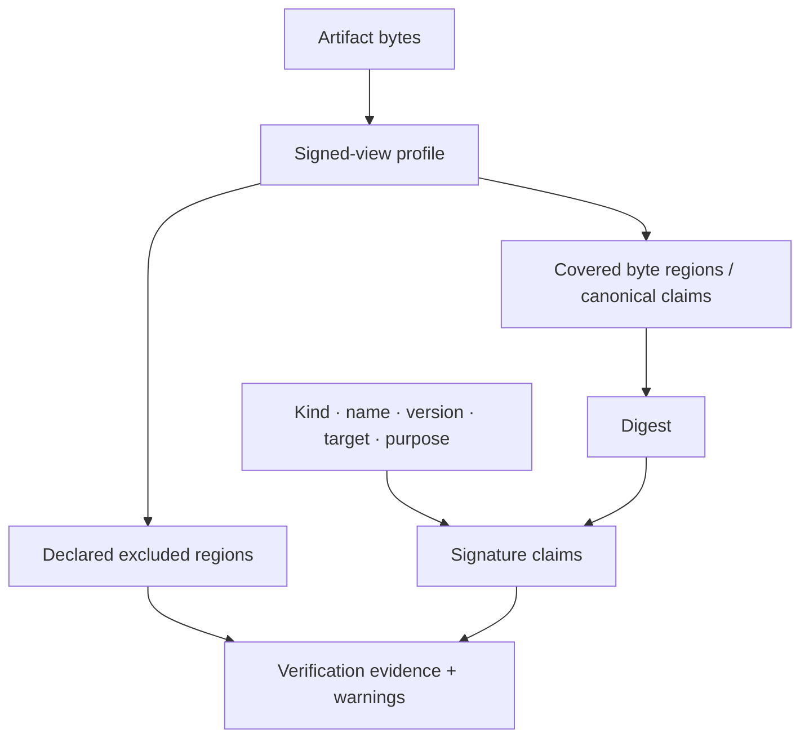

# Artifact model and signed views

**RM-SIGNED-ARTIFACT-0001:** An artifact identity includes artifact kind, media/format profile, logical name and namespace, version, target platform/architecture, distribution channel, and content digest; a filename is not identity.

**RM-SIGNED-ARTIFACT-0002:** Every signature references a versioned signed-view profile that defines exact covered bytes or canonical claims, excluded regions, normalization, and whether any transformation invalidates the signature.

**RM-SIGNED-ARTIFACT-0003:** Canonicalization profiles define field ordering, encoding, Unicode treatment, numeric representation, path separators/case, archive ordering and metadata, symlink handling, duplicate-name rejection, and unknown-field behavior. A verifier never guesses a profile.

**RM-SIGNED-ARTIFACT-0004:** Parsers reject ambiguous, overlapping, recursive, truncated, duplicate, trailing, or resource-exhausting structures before signature acceptance. Covered and executable/interpreted bytes cannot diverge silently.

**RM-SIGNED-ARTIFACT-0005:** Embedded, detached, catalog, repository-metadata, and manifest signatures preserve their distinct coverage semantics. A detached signature binds the artifact digest and identity, not a mutable path or URL.

**RM-SIGNED-ARTIFACT-0006:** Package signatures bind a complete content tree and security-relevant install metadata. Repository metadata, transport authentication, dependency resolution, and installed-state verification are separate evidence.

**RM-SIGNED-ARTIFACT-0007:** Document profiles identify the signed revision/byte ranges, permitted post-sign changes, external resources, active content, form/appearance semantics, and visual-presentation nonclaims.

**RM-SIGNED-ARTIFACT-0008:** Multiple signatures are an ordered evidence set. Threshold, role separation, replacement, countersignature, and endorsement semantics come only from policy and never from signature count.

## Signed claim set

The common claim set carries signed-view profile/version, digest algorithm/value, artifact identity, semantic purpose, signer role, target, policy generation, creation request identifier, and optional provenance/SBOM references. Format-native envelopes may encode these differently, but adapters must report loss and ambiguity.

