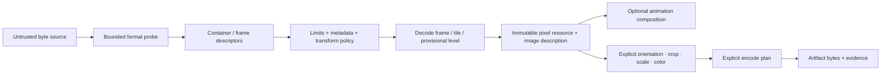

# Still-image and image-codec foundations vertical slice

| Field | Value |
|---|---|
| Status | Draft domain analysis |
| Purpose | Safely probe, inspect, decode, compose, transform, and encode bounded still-image containers with exact pixel, color, orientation, metadata, and lifecycle semantics |

## Conclusions

- Byte source, detected container, image item/frame, coded payload, decoded pixels, animation canvas, thumbnail/preview, metadata, and encoded artifact are distinct entities.
- File extension, MIME type, magic match, declared brand, and successful decode are separate evidence. None makes content trusted.
- Every parse/decode is budgeted before allocation using checked arithmetic and incremental enforcement; dimensions alone are not a sufficient limit.
- Decoded output is immutable and self-describing. Orientation, color, alpha, range, precision, memory domain, and lifetime never hide behind “RGBA.”
- Progressive/interlaced output is provisional revisioned evidence. Animation timing, disposal, blending, looping, and compositing are separate from frame decode.
- Encoding uses an immutable plan and reports exact effective settings, metadata policy, determinism, and loss/fidelity; “quality” is not a portable scalar.

## Documents

- [Probe and container inspection](probe-container.md)
- [Decode contracts and resource limits](decode-limits.md)
- [Pixel, color, alpha, and orientation semantics](pixel-semantics.md)
- [Progressive, tiled, and region decode](progressive-region.md)
- [Animation and multi-image containers](animation.md)
- [Metadata, privacy, and provenance](metadata.md)
- [Encode and transcode plans](encode-transcode.md)
- [Security and accessibility](security-accessibility.md)
- [Platform research](platform-research.md)
- [Conformance](conformance.md)
- [Benchmarks](benchmarks.md)
