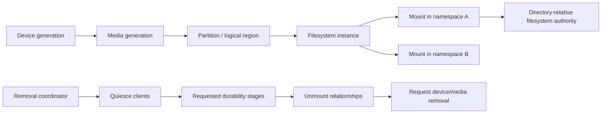

# Storage volumes and removable-media foundations vertical slice

| Field | Value |
|---|---|
| Status | Draft domain analysis |
| Purpose | Model media, partitions, filesystem instances, mount relationships, capacity, and coordinated removal without confusing paths, volumes, or physical devices |

## Conclusions

- Physical devices, media, partitions/logical regions, filesystem instances, mounts, and paths are different entities with different generations.
- A filesystem can have zero, one, or many mounts, including bind/volume mount points and per-namespace views.
- Volume labels, UUIDs, drive letters, mount paths, device nodes, and serials are evidence, not universal identity or authority.
- Mount/unmount/eject are privileged policy services with explicit arbitration and user interaction; observation remains side-effect free.
- Safe removal coordinates quiescence, requested flush stages, unmount, and eject, but cannot prevent surprise removal or strengthen a device's durability guarantees.
- Formatting, partition editing, encryption unlock, repair, backup, snapshot management, and raw block I/O remain separate high-risk services.

## Documents

- [Entity and identity model](entity-identity.md)
- [Volume and mount observation](observation.md)
- [Capacity and properties](capacity-properties.md)
- [Mount and unmount service](mount-service.md)
- [Removal coordination](removal-coordination.md)
- [Durability and failure](durability-failure.md)
- [Security, privacy, and accessibility](security-accessibility.md)
- [Platform research](platform-research.md)
- [Conformance](conformance.md)
- [Benchmarks](benchmarks.md)
