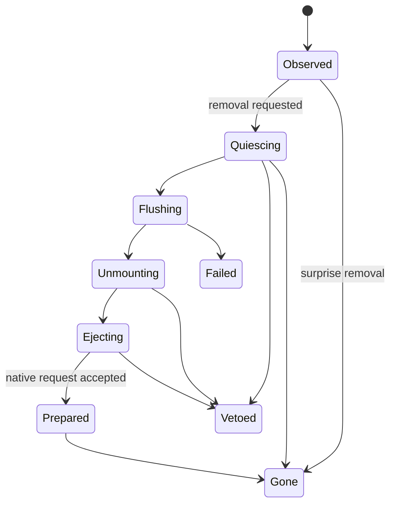

# Removable-media coordination

The removal service orchestrates product quiescence, requested durability stages, unmount of in-scope relationships, and native eject/safe-removal requests. Its authority is scoped to an exact current media/device generation.

**RM-STORAGE-REMOVE-0001:** Safe removal MUST be modeled as a coordinated request with milestones, not as a guarantee that media remains present or all data is durable.

**RM-STORAGE-REMOVE-0002:** The request MUST identify whether it targets one mount, one filesystem, all volumes on media, media eject, or device removal; the service MUST NOT infer escalation.

**RM-STORAGE-REMOVE-0003:** Quiescence participants MUST use bounded deadlines and return ready, veto-with-reason, failed, or disappeared. Inhibition cannot prevent physical unplug or power loss.

**RM-STORAGE-REMOVE-0004:** Force behavior requires explicit authority and data-loss acknowledgment and MUST report skipped flushes, detached mounts, active clients, and platform nonclaims.

**RM-STORAGE-REMOVE-0005:** Success MUST report completed milestones and current observed state. Prepared-for-removal, electrically ejected, media absent, and user-safe-to-unplug are distinct when the platform exposes them.

See [ADR-0055](../../adr/0055-safe-removal-is-coordination-not-a-durability-guarantee.md).
