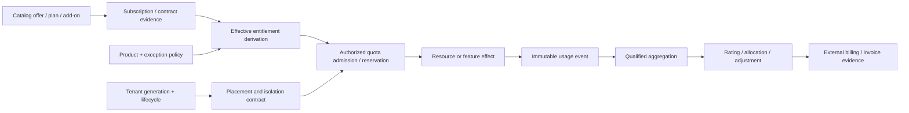

# Tenant lifecycle, entitlements, metering, and quota governance

| Field | Value |
|---|---|
| Status | Draft domain analysis |
| Purpose | Govern tenant service lifecycle, isolation, product eligibility, measured consumption, and quota admission without confusing commercial records with authorization, capacity, effects, or invoices |

## Conclusions

- Tenant identity/lifecycle, account/directory identity, billing account, resource partition, subscription, entitlement, authorization, capacity, usage, charge, invoice, and payment are distinct.
- An entitlement is eligibility evidence. It does not independently authorize an actor, reserve capacity, or prove a feature effect.
- Meter events are immutable observations; late data, corrections, reversals, and disputes create new provenance-bearing adjustments.
- Quota admission, reservation, consumption, release, measurement, and billing are separate milestones with explicit consistency and failure semantics.
- Tenant closure is multi-boundary reconciliation across access, data, resources, secrets, integrations, meters, billing, retention, and residuals.

## Documents

- [Model and evidence boundaries](model.md)
- [Tenant lifecycle and ownership](tenant-lifecycle.md)
- [Resource partitioning, placement, and isolation](partition-isolation.md)
- [Catalogs, plans, subscriptions, trials, and add-ons](plans-subscriptions.md)
- [Feature entitlements and effective eligibility](entitlements.md)
- [Usage dimensions and immutable meter events](metering-events.md)
- [Aggregation, rating, allocation, and correction](aggregation-rating.md)
- [Quota admission, reservations, and enforcement](quotas-reservations.md)
- [Billing, invoice, payment, and tax boundaries](billing-boundaries.md)
- [Grace, offline, and degraded operation](grace-offline.md)
- [Evolution and tenant migration](migration.md)
- [Operations, disputes, and reconciliation](operations-disputes.md)
- [Cross-cutting qualities](cross-cutting.md)
- [Platform and standards research](platform-research.md)
- [Conformance](conformance.md)
- [Benchmarks](benchmarks.md)

## Decisions

- [ADR-0140: Entitlement is eligibility evidence, not effect authority](../../adr/0140-entitlement-is-eligibility-evidence-not-effect-authority.md)
- [ADR-0141: Meter corrections are immutable adjustments](../../adr/0141-meter-corrections-are-immutable-adjustments.md)

## Boundary

This domain composes identity governance, authentication, authorization, policy, persistence, coordination, workflow, API governance, synchronization, observability, privacy, and delivery. It does not choose product packaging, price, currency, tax treatment, payment processor, billing vendor, tenant topology, isolation tier, quota values, overage policy, or accounting conclusion.
