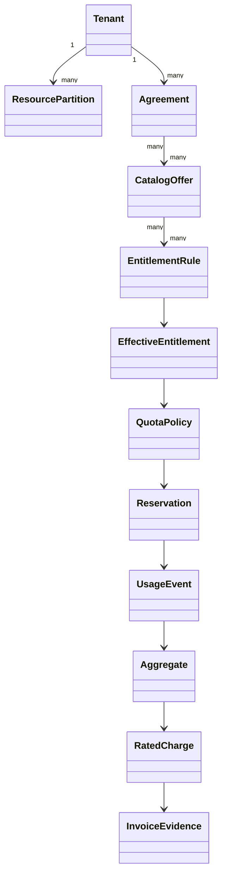

# Model and evidence boundaries

**RM-TENANT-GOV-MODEL-0001:** Tenant, organization/account, billing account, subscription, contract, resource partition, deployment cell, and identity-provider directory retain separate stable identities and explicit mappings.

**RM-TENANT-GOV-MODEL-0002:** Catalog offer, plan, price, feature, entitlement rule, quota, meter, rating rule, tax rule, and service objective are immutable versioned definitions with independent effective periods.

**RM-TENANT-GOV-MODEL-0003:** Commercial eligibility, effective entitlement, actor authorization, quota admission, capacity reservation, effect acceptance, effect completion, measured usage, rated charge, invoice, and payment are distinct milestones.

**RM-TENANT-GOV-MODEL-0004:** Every derivation binds tenant and subject scope, source generations, effective instant/period, policy, exceptions, authority, consistency/freshness, confidence, and expiration.

**RM-TENANT-GOV-MODEL-0005:** `Active`, `paid`, `entitled`, `within quota`, `available`, and `authorized` are never interchangeable status labels.
