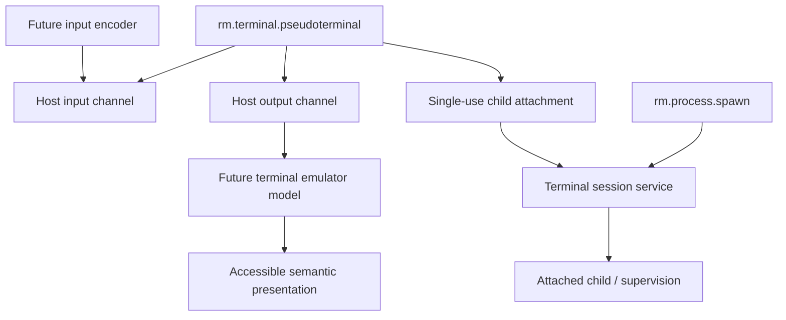

# Terminal foundations vertical slice

| Field | Value |
|---|---|
| Status | Draft domain analysis |
| Purpose | Separate pseudoterminal session mechanics from byte pipes, terminal protocol interpretation, rendering, input, and accessibility |

## Domain boundary

The initial domain creates and controls a pseudoterminal-like session with host input/output channels, child attachment, character-cell size, lifecycle, and declared wire/terminal semantics.

Terminal emulation/rendering, escape-sequence parsing, keyboard/mouse/IME encoding, scrollback, fonts, Unicode width, shell integration, remote transport, login sessions, and accessibility presentation remain higher capabilities, services, or frameworks.

## Boundary conclusions

- A pseudoterminal is a stateful protocol-bearing device/session, not a byte pipe.
- Windows ConPTY uses UTF-8 text interleaved with virtual-terminal sequences; POSIX PTYs expose native byte streams plus terminal line discipline and do not supply one universal encoding.
- Child attachment and release must occur without an unrestricted/intermediate launch window.
- Terminal size is character rows/columns; pixel size is an optional extension.
- Input bytes are not portable keyboard events, and output bytes are not an accessible UI tree.
- Accessibility and internationalization require a terminal host/emulator above the raw session.

## Documents

- [Terminal semantic model](terminal-model.md)
- [`rm.terminal.pseudoterminal`](pseudoterminal.md)
- [Terminal session platform service](session-service.md)
- [Platform research](platform-research.md)
- [Conformance specification](conformance.md)
- [Benchmark specification](benchmarks.md)

