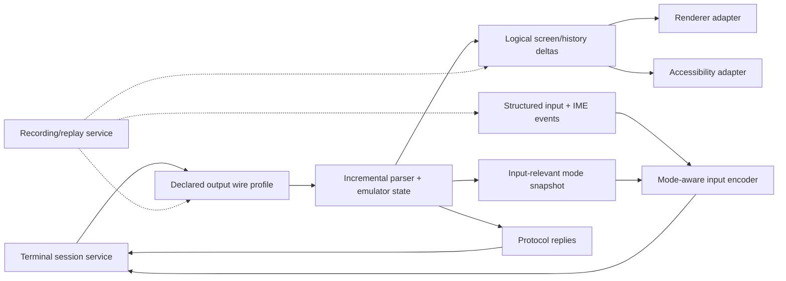

# Terminal host domain framework

| Field | Value |
|---|---|
| Status | Draft framework contract |
| Contract version | 0.1.0 |
| Layer | Domain frameworks |

## Purpose

Compose a terminal session, incremental emulator state machine, structured input encoder, renderer adapter, accessibility adapter, clipboard/link policy, and optional recording service into an interactive terminal host without making OS backends own presentation policy.

## Framework rules

- The parser/emulator is a deterministic state transition over ordered bytes, resize/control events, and an explicit dialect/version.
- Protocol replies are generated on a separately typed path from user input and remain causally linked to the triggering query.
- Renderer and accessibility adapters consume logical deltas/snapshots; they never parse raw untrusted terminal bytes independently.
- Input encoding consumes structured events plus the exact emulator mode revision, avoiding races between mode changes and keystrokes.
- Clipboard, hyperlinks, notifications, file transfer, images, and host commands are privileged protocol effects mediated by explicit policy.
- Recording is off by default and cannot be enabled merely because observability is enabled.
- A headless emulator may omit rendering but still exposes logical state and accessibility-oriented text events where meaningful.

## Completion boundary

An end-user terminal product is conformant only when session, parser/emulator, input, rendering, accessibility, i18n, security-policy, and lifecycle evidence all satisfy its product profile. Individual component conformance never implies whole-host conformance.

