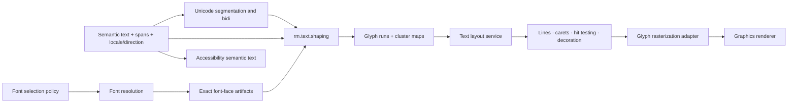

# Text, fonts, and layout vertical slice

| Field | Value |
|---|---|
| Status | Draft domain analysis |
| Purpose | Preserve semantic Unicode text while specifying reproducible font resolution, shaping, layout, hit testing, and glyph presentation boundaries |

## Domain boundary

Text remains logical Unicode content. Fonts and shaping produce a visual representation with reversible cluster/caret mappings where the contract promises them. Accessibility, search, copy, editing, and security policy consume semantic text—not glyph IDs, pixels, or visual order.

## Architectural conclusions

- Every index/range names its unit, text revision, and boundary validity.
- Font discovery is policy and environment observation; shaping consumes exact resolved font artifacts.
- A glyph is not a character. Many-to-many text/glyph cluster mappings are normal.
- Segmentation, bidi, shaping, line breaking, layout, and rasterization are separate versioned stages.
- Portable conformance compares semantic mappings and metrics within declared tolerances; unrelated platform rasterizers need not produce identical pixels.
- Terminal cell allocation remains authoritative for terminal layout even when the shared shaping/rasterization stack supplies glyphs.

## Documents

- [Unicode text model](unicode-model.md)
- [`rm.text.font-resolution`](font-resolution.md)
- [`rm.text.shaping`](shaping.md)
- [Text layout service](layout-service.md)
- [Glyph rasterization adapter](rasterization.md)
- [Platform and standards research](platform-research.md)
- [Conformance specification](conformance.md)
- [Benchmark specification](benchmarks.md)

