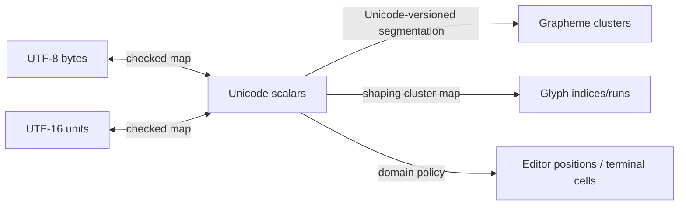

# Unicode text model

**RM-TEXT-UNICODE-0001:** Semantic text is a sequence of Unicode scalar values encoded for storage by an explicitly named encoding. Ill-formed external input is rejected or replaced under a declared boundary policy before entering the semantic model.

**RM-TEXT-UNICODE-0002:** Every position/range names text identity/revision and unit: byte, UTF-16 code unit, scalar, extended grapheme cluster, word, line-break opportunity, logical line, or domain unit such as terminal cell. Bare integer offsets are not cross-component contracts.

**RM-TEXT-UNICODE-0003:** Checked conversions fail when an endpoint splits an encoding unit, scalar, prohibited grapheme boundary, or stale revision. Conversion does not round silently.

**RM-TEXT-UNICODE-0004:** Normalization is explicit, versioned, and purpose-specific. Text is not normalized merely for display; security identifiers, search, collation, filenames, and editing may require different policies.

**RM-TEXT-UNICODE-0005:** Grapheme/word/sentence segmentation declares Unicode/CLDR data version and tailoring. Default segmentation does not claim perfect language-specific user perception.

**RM-TEXT-UNICODE-0006:** Bidirectional resolution declares Unicode version, paragraph boundary/base direction, isolation/override handling, and higher-level protocol rules. Logical storage order remains distinct from visual run order.

**RM-TEXT-UNICODE-0007:** Line-break opportunities declare Unicode/CLDR version, language/script tailoring, whitespace preservation, mandatory-break behavior, and prohibited-break rules. Hyphenation is a separate optional service with dictionary/model provenance.

**RM-TEXT-UNICODE-0008:** Case mapping, case folding, collation, transliteration, and spoof/confusable analysis are separate locale/security services and are not inferred from shaping.

**RM-TEXT-UNICODE-0009:** Unicode data files and algorithm versions are immutable build/runtime evidence. An upgrade that can change segmentation, width, bidi, or layout results requires compatibility impact review.

## Position mapping

