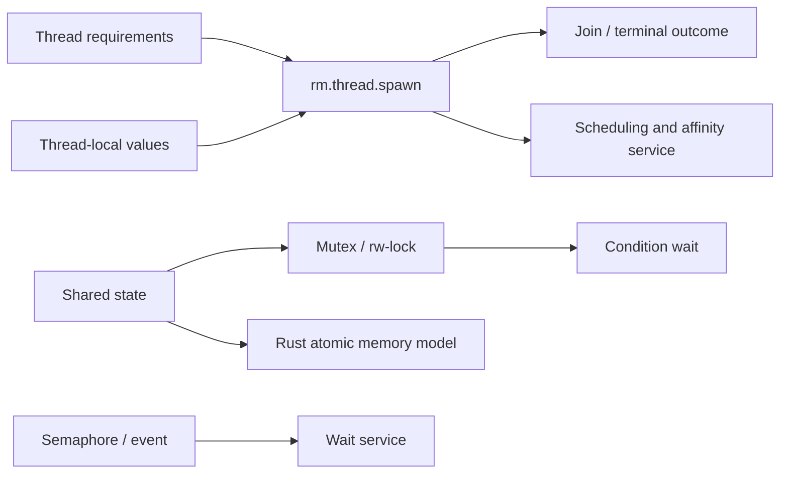

# Threading and synchronization foundations vertical slice

| Field | Value |
|---|---|
| Status | Draft domain analysis |
| Purpose | Model native thread ownership, scheduling constraints, synchronization, atomics, waiting, and thread-local lifecycle without promising scheduler outcomes |

## Conclusions

- Native threads, runtime tasks, dispatch queues, and processes are distinct execution resources.
- Priority, QoS, affinity, ideal processor, and realtime policy are requests with scoped evidence, not completion or exclusion guarantees.
- Synchronization specifies happens-before, ownership, wakeup, poisoning/recovery, timeout, and fairness separately.
- Condition variables permit spurious wakeups; predicates remain protected state.
- Atomics follow the Rust memory model and supported widths; they do not make compound protocols correct automatically.
- Forced thread termination is prohibited in safe portable use.

## Documents

- [Thread lifecycle](thread-lifecycle.md)
- [Mutexes and reader/writer locks](mutex-rwlock.md)
- [Condition, semaphore, event, and wait](wait-primitives.md)
- [Atomics and memory ordering](atomics.md)
- [Scheduling, affinity, and realtime](scheduling-affinity.md)
- [Thread-local state](thread-local.md)
- [Platform research](platform-research.md)
- [Conformance](conformance.md)
- [Benchmarks](benchmarks.md)

