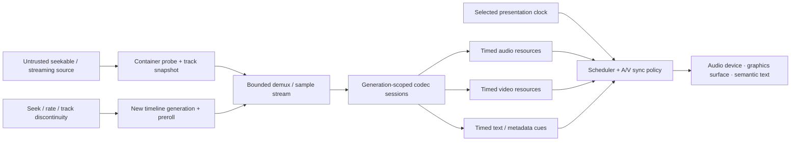

# Time-based media foundations vertical slice

| Field | Value |
|---|---|
| Status | Draft domain analysis |
| Purpose | Inspect, demultiplex, decode, synchronize, seek, play, encode, and multiplex bounded time-based audio/video/text media with exact timeline and lifecycle semantics |

## Conclusions

- Container, presentation, decode, running, device, and wall-clock time domains are distinct exact rational values with explicit mappings and discontinuities.
- Source probing, demux, codec configuration, raw media output, playback scheduling, rendering, and sink completion are separate capabilities.
- Track descriptors and codec configuration are immutable generations. Midstream change, flush, seek, reset, loss, and fallback create explicit discontinuities.
- Seek requests specify target domain, tolerance/direction, accuracy, and latency policy; completion reports attained and presentation-ready milestones.
- Audio commonly supplies the playback time source, but clock selection is negotiated. Drift correction, frame drop/repeat, audio stretch, and latency are explicit policy.
- Network adaptive streaming, DRM/license acquisition, content recommendation, editing, conferencing, broadcast capture, and application controls remain separate services.

## Documents

- [Media source, container, and tracks](source-container-tracks.md)
- [Exact timeline and timestamp model](timeline.md)
- [Codec sessions and encoded samples](codec-session.md)
- [Raw audio, video, and metadata output](raw-output.md)
- [Playback clock and synchronization](playback-synchronization.md)
- [Seeking, buffering, and discontinuity](seeking-buffering.md)
- [Timed text, chapters, and accessibility](timed-text-accessibility.md)
- [Encode, mux, and recording boundaries](encode-mux.md)
- [Security, privacy, and protected content](security-protected.md)
- [Platform research](platform-research.md)
- [Conformance](conformance.md)
- [Benchmarks](benchmarks.md)
