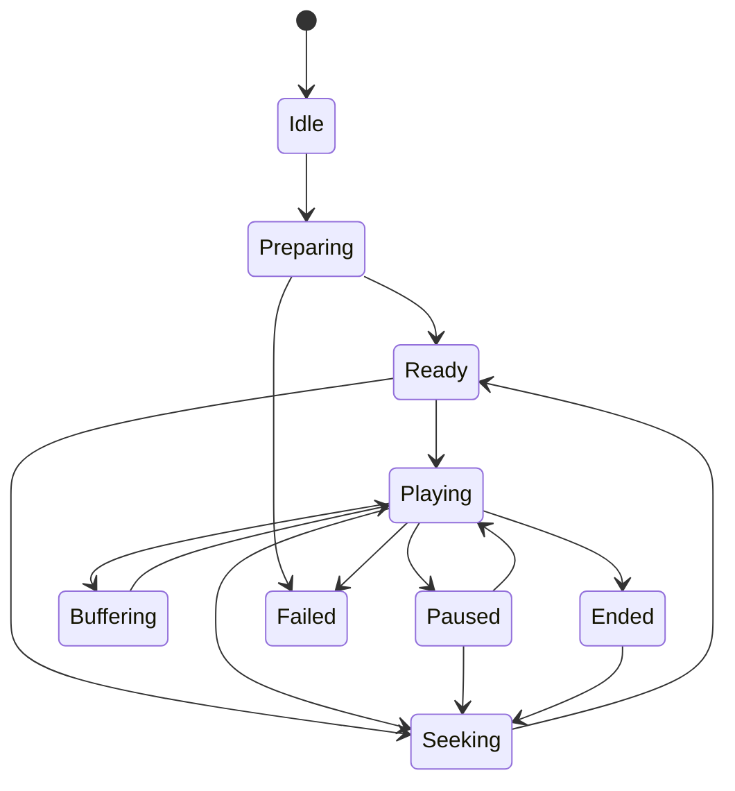

# Playback clock and synchronization

`rm.media.playback` coordinates selected tracks, codec sessions, sinks, and one presentation clock under explicit latency/quality policy.

**RM-MEDIA-PLAY-0001:** A session binds source/presentation/track generations, selected clock/time source, start position, playback rate, latency mode, buffer bounds, A/V/text sync tolerances, late/drop/repeat/conceal policy, audio adaptation, sink generations, and power/background policy.

**RM-MEDIA-PLAY-0002:** Preparing, ready, playing, paused, buffering, seeking, ended, stopped, failed, and closed are distinct revisioned states. Play/pause/rate calls are requests; observed clock and sink milestones determine effective state.

**RM-MEDIA-SYNC-0001:** Clock selection reports source, domain, accuracy/stability, rate-control capability, correlation, and failover. Audio-device time is preferred where suitable for ordinary A/V playback but is not universal or implicit.

**RM-MEDIA-SYNC-0002:** Scheduling compares mapped sample presentation time with the selected clock and reports lateness/earliness. Video drop/repeat, audio resample/stretch/insert/drop, subtitle timing adjustment, and clock slew/rebase are separate bounded corrections.

**RM-MEDIA-SYNC-0003:** Sync evidence includes per-stream skew, correction, queue latency, device/compositor presentation evidence, timestamp quality, and measurement boundary. Frame submission or audio-buffer acceptance is not proof of sight/sound at the user.

**RM-MEDIA-PLAY-0003:** Ended requires selected tracks drained and sink completion at the declared boundary. Looping creates a new discontinuity generation; it is not a timestamp wrap.

**RM-MEDIA-PLAY-0004:** UI and accessibility actions enter the ordinary command path; playback engine callbacks never manipulate widgets or announce directly.
