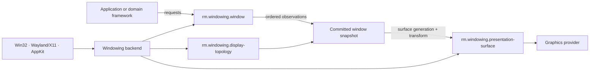

# Windowing foundations vertical slice

| Field | Value |
|---|---|
| Status | Draft domain analysis |
| Purpose | Define portable top-level window, display-topology, and presentation-surface semantics without absorbing graphics, input, or product policy |

## Domain boundary

Windowing owns native top-level window lifetime, compositor negotiation, display observations, scale and coordinate transforms, event delivery, and the generation of a presentation target. It does not own drawing, text shaping, widget layout, input interpretation, or accessibility-tree content.

## Boundary conclusions

- Window mutation is negotiated: an API request is not proof of observed native state.
- A committed snapshot is the atomic source for logical extent, scale, surface extent, display association, and generation.
- Logical, surface-pixel, and display coordinate spaces are distinct typed spaces; conversion always names a snapshot revision.
- Native callbacks may be synchronous and reentrant, but portable consumer delivery is ordered and non-reentrant.
- A presentation surface is a window-owned, generation-scoped resource. Graphics renders into it but does not own the window.
- Close requests, destruction, focus, visibility, occlusion, and activation are separate observations.
- Global desktop coordinates are optional provider evidence, not a portable invariant.

## Documents

- [`rm.windowing.window`](window.md)
- [`rm.windowing.display-topology`](display-topology.md)
- [`rm.windowing.presentation-surface`](presentation-surface.md)
- [Coordinate and scale model](coordinate-model.md)
- [Event and concurrency model](event-model.md)
- [Platform research](platform-research.md)
- [Conformance specification](conformance.md)
- [Benchmark specification](benchmarks.md)

