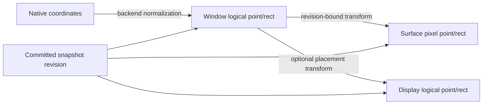

# Coordinate and scale model

## Spaces

| Space | Meaning | Portable origin |
|---|---|---|
| Window logical | Layout and pointer coordinates within content | Content origin |
| Surface pixel | Addressable presentation-buffer units | Surface origin |
| Display logical | Provider-reported display-relative placement | Display origin |
| Native | Backend-only coordinates and transforms | Platform-defined |

**RM-WINDOWING-COORD-0001:** Values from different spaces are distinct semantic types and cannot be combined without an explicit transform.

**RM-WINDOWING-COORD-0002:** Each transform is tied to a committed window/display revision and includes orientation, reflection, translation, and rational scale where applicable. Floating-point scale alone is insufficient identity.

**RM-WINDOWING-COORD-0003:** Logical-to-pixel conversion declares edge rounding. Extents transform edges then subtract; repeated delta conversion must not accumulate drift.

**RM-WINDOWING-COORD-0004:** A scale or transform change and its new logical extent, pixel extent, display association, and surface generation are observed atomically in one committed snapshot.

**RM-WINDOWING-COORD-0005:** Stale transforms are rejected for security-sensitive hit testing and identified for ordinary rendering/input reconciliation. Providers never reinterpret old coordinates under a new scale silently.

**RM-WINDOWING-COORD-0006:** Physical size, physical DPI, and global desktop position are optional measurements with provenance and uncertainty. A backing scale is not evidence of physical density.

